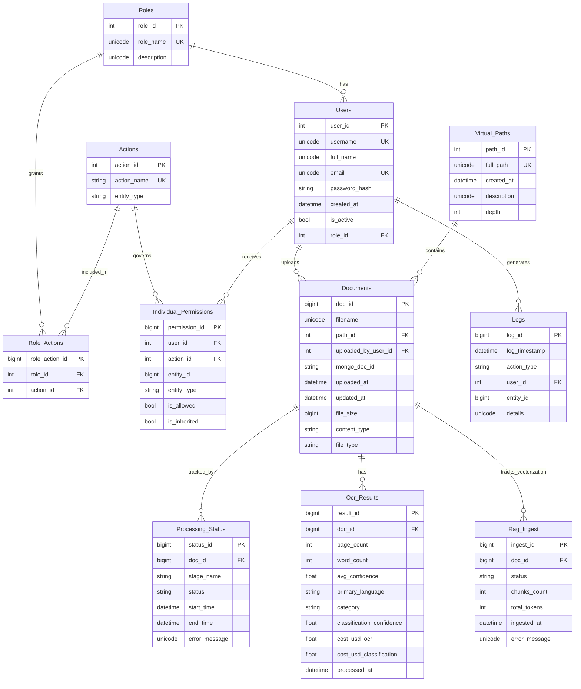

# Database Schema

NassaQ uses **Azure SQL Server** as its primary relational database. The schema is designed around a role-based access control (RBAC) system, document status tracking, audit logging, RAG ingest metrics, and detailed OCR results auditing.

!!! note "Schema Origin"
    The SQLAlchemy ORM models were reverse-engineered from the active database using `sqlacodegen`. Schema structures are managed centrally via Azure SQL and ORM mapping dependencies.

---

## Entity Relationship Diagram



---

## Table Descriptions

### Users

The central user table. New users are created as **inactive** (`is_active = false`) with no assigned role. An administrator must activate users and assign them a role before they can access the system.

| Column | Type | Constraints | Description |
|:---|:---|:---|:---|
| `user_id` | `INT` | PK, Identity | Auto-incrementing primary key |
| `username` | `NVARCHAR(50)` | Unique, Not Null | Login username (auto-generated on registration) |
| `full_name` | `NVARCHAR(100)` | Not Null | User's display name |
| `email` | `NVARCHAR(100)` | Unique, Not Null | Email address |
| `password_hash` | `VARCHAR(255)` | Not Null | bcrypt-hashed password |
| `created_at` | `DATETIME` | Not Null, Default: `getdate()` | Account creation timestamp |
| `is_active` | `BIT` | Not Null, Default: `0` | Whether the user can log in |
| `role_id` | `INT` | FK -> Roles, Default: `1` | Assigned role |

---

### Roles

Defines the roles available in the system. Role `99` is reserved for **administrators** and is checked in the FastAPI dependency chain.

| Column | Type | Constraints | Description |
|:---|:---|:---|:---|
| `role_id` | `INT` | PK, Identity | Auto-incrementing primary key |
| `role_name` | `NVARCHAR(50)` | Unique, Not Null | Human-readable role name |
| `description` | `NVARCHAR(255)` | Nullable | Role description |

---

### Actions

Represents individual actions that can be performed within the system (e.g., "read", "write", "delete"), scoped to an `entity_type`.

| Column | Type | Constraints | Description |
|:---|:---|:---|:---|
| `action_id` | `INT` | PK, Identity | Auto-incrementing primary key |
| `action_name` | `VARCHAR(50)` | Unique, Not Null | Action identifier |
| `entity_type` | `VARCHAR(20)` | Not Null | Scoped entity |

---

### Role_Actions

Junction table mapping roles to actions to configure role-level permissions.

| Column | Type | Constraints | Description |
|:---|:---|:---|:---|
| `role_action_id` | `BIGINT` | PK, Identity | Primary key |
| `role_id` | `INT` | FK -> Roles, Not Null | The role being granted access |
| `action_id` | `INT` | FK -> Actions, Not Null | The action being granted |

**Unique constraint:** `(role_id, action_id)` -- prevents duplicate grants.

---

### Virtual_Paths

Represents the **virtual folder hierarchy** for organizing files. Paths are stored as full path strings (e.g., `/dept/finance`) with a depth field (root level starts at `0`).

| Column | Type | Constraints | Description |
|:---|:---|:---|:---|
| `path_id` | `INT` | PK, Identity | Auto-incrementing primary key |
| `full_path` | `NVARCHAR(500)` | Unique, Not Null | Unique full folder path string |
| `created_at` | `DATETIME` | Not Null, Default: `getdate()` | Path creation timestamp |
| `description` | `NVARCHAR(MAX)` | Nullable | Description of folder |
| `depth` | `INT` | Not Null | Folder nesting depth |

---

### Documents

Stores relational metadata for every uploaded file. The raw file body is in Azure Blob Storage; this table tracks the pointer.

| Column | Type | Constraints | Description |
|:---|:---|:---|:---|
| `doc_id` | `BIGINT` | PK, Identity | Auto-incrementing primary key |
| `filename` | `NVARCHAR(255)` | Not Null | Original filename |
| `path_id` | `INT` | FK -> Virtual_Paths, Not Null | Virtual folder location |
| `uploaded_by_user_id` | `INT` | FK -> Users, Not Null | User ID of uploader |
| `mongo_doc_id` | `VARCHAR(36)` | Not Null | Cosmos DB document reference ID |
| `uploaded_at` | `DATETIME` | Not Null, Default: `getdate()` | Upload date |
| `updated_at` | `DATETIME` | Nullable | Update date |
| `file_size` | `BIGINT` | Nullable | Size in bytes |
| `content_type` | `VARCHAR(100)` | Nullable | MIME Type |
| `file_type` | `VARCHAR(10)` | Nullable | File extension (e.g., `pdf`, `png`) |

**Unique constraint:** `(filename, path_id)` -- prevents duplicate filenames within the same virtual folder.

---

### Ocr_Results

Stores structured, granular transaction statistics generated during the cloud OCR and classification process.

| Column | Type | Constraints | Description |
|:---|:---|:---|:---|
| `result_id` | `BIGINT` | PK, Identity | Primary key |
| `doc_id` | `BIGINT` | FK -> Documents, Not Null | Linked document ID |
| `page_count` | `INT` | Not Null | Page count of document |
| `word_count` | `INT` | Not Null | Word count |
| `avg_confidence` | `FLOAT` | Not Null | Average layout extraction confidence |
| `primary_language` | `VARCHAR(10)` | Not Null | Detected language code (e.g. `ar`, `en`) |
| `category` | `VARCHAR(50)` | Nullable | Classified category |
| `classification_confidence` | `FLOAT` | Nullable | Classification confidence |
| `cost_usd_ocr` | `FLOAT` | Not Null | Transaction cost of Document Intelligence |
| `cost_usd_classification` | `FLOAT` | Nullable | Transaction cost of Azure OpenAI classification |
| `processed_at` | `DATETIME` | Not Null, Default: `getutcdate()` | Timestamp of metric insertion |

---

### Rag_Ingest

Tracks RAG vectorization jobs, chunk allocations, and token consumption statistics.

| Column | Type | Constraints | Description |
|:---|:---|:---|:---|
| `ingest_id` | `BIGINT` | PK, Identity | Primary key |
| `doc_id` | `BIGINT` | FK -> Documents, Not Null | Associated document ID |
| `status` | `VARCHAR(20)` | Not Null | Vector status (e.g. `"Finished"`, `"Failed"`) |
| `chunks_count` | `INT` | Not Null, Default: `0` | Number of text chunks created in Pinecone |
| `total_tokens` | `INT` | Not Null, Default: `0` | Total tokens consumed by OpenAI embedding model |
| `ingested_at` | `DATETIME` | Not Null, Default: `getdate()` | Timestamp of vectorization |
| `error_message` | `NVARCHAR(MAX)` | Nullable | Error logs in case of vector failures |

---

### Processing_Status

Tracks the multi-stage lifecycle of documents through background worker queues.

| Column | Type | Constraints | Description |
|:---|:---|:---|:---|
| `status_id` | `BIGINT` | PK, Identity | Primary key |
| `doc_id` | `BIGINT` | FK -> Documents, Not Null | Target document ID |
| `stage_name` | `VARCHAR(50)` | Not Null | Stage (e.g. `"OCR"`, `"Classification"`, `"Vectorization"`) |
| `status` | `VARCHAR(20)` | Not Null | Stage status (`"Queued"`, `"Processing"`, `"Finished"`, `"Failed"`) |
| `start_time` | `DATETIME` | Not Null, Default: `getdate()` | Start timestamp |
| `end_time` | `DATETIME` | Nullable | End timestamp |
| `error_message` | `NVARCHAR(MAX)` | Nullable | Error logs in case of stage failures |

---

### Individual_Permissions

Provides fine-grained, user-level permission overrides that bypass standard role roles (not yet active in API).

| Column | Type | Constraints | Description |
|:---|:---|:---|:---|
| `permission_id` | `BIGINT` | PK, Identity | Primary key |
| `user_id` | `INT` | FK -> Users, Not Null | Target user |
| `action_id` | `INT` | FK -> Actions, Not Null | Target action |
| `entity_id` | `BIGINT` | Not Null | Specific document/folder ID |
| `entity_type` | `VARCHAR(20)` | Not Null | Scoped entity class |
| `is_allowed` | `BIT` | Not Null | Grants (`1`) or denies (`0`) access |
| `is_inherited` | `BIT` | Not Null, Default: `0` | Is inherited from parent path |

---

### Logs

Audit trail table tracking authentication and administrative transaction histories.

| Column | Type | Constraints | Description |
|:---|:---|:---|:---|
| `log_id` | `BIGINT` | PK, Identity | Primary key |
| `log_timestamp` | `DATETIME` | Not Null, Default: `getdate()` | Transaction timestamp |
| `action_type` | `VARCHAR(50)` | Not Null | Event type (e.g. `"document_upload"`, `"rag_ingest"`) |
| `user_id` | `INT` | FK -> Users, Nullable | Responsible user ID |
| `entity_id` | `BIGINT` | Nullable | Relational subject entity |
| `details` | `NVARCHAR(MAX)` | Nullable | Transaction summary log text |

---

## Access Patterns by Service

| Table | Backend Server | Local OCR Worker | AI Foundry Worker |
|:---|:---:|:---:|:---:|
| `Users` | Read / Write | -- | -- |
| `Roles` | Read | -- | -- |
| `Virtual_Paths` | Read / Write | -- | -- |
| `Documents` | Read / Write | Write (`mongo_doc_id`) | Write (`mongo_doc_id`) |
| `Ocr_Results` | Read | -- | Write (statistics & costs) |
| `Rag_Ingest` | Read / Write | -- | -- |
| `Processing_Status` | Read / Create | Write (status updates) | Write (status updates) |
| `Logs` | Read / Write | -- | -- |

---

## Connection Configuration

Services connect to Azure SQL using SQL Alchemy 2.0 connection pools:

```
SQLAlchemy 2.0 (async) -> aioodbc -> pyodbc -> ODBC Driver 18 for SQL Server -> Azure SQL
```

Pool features are optimized for high-volume transactions and Azure SQL Database sleep-state cold starts:
- `pool_pre_ping=True`: Verifies connection health before running queries.
- `pool_recycle=1800`: Automatically recycles connection streams every 30 minutes.
- `SQL_MAX_RETRIES=3` with exponential backoff (`2s`, `4s`, `8s` delays) to handle sleeping DB cold starts.

---

## Cosmos DB (MongoDB API) Integration

**Status: Fully Integrated (Premium Path)**

For the cloud-native pipeline, **Azure Cosmos DB** (MongoDB API) stores the parsed document text and JSON layouts. 
- Large files (extracted layout blocks, deep paragraph grids, complete page indexes) are offloaded to Cosmos DB collections.
- The `Documents.mongo_doc_id` field contains the primary key `_id` of the Cosmos DB NoSQL document.
- The backend server pulls parsed plain text and tables from Cosmos DB during the **RAG Ingest** phase to perform semantic chunking and embedding, preventing large-string bloat inside the Azure SQL database.
