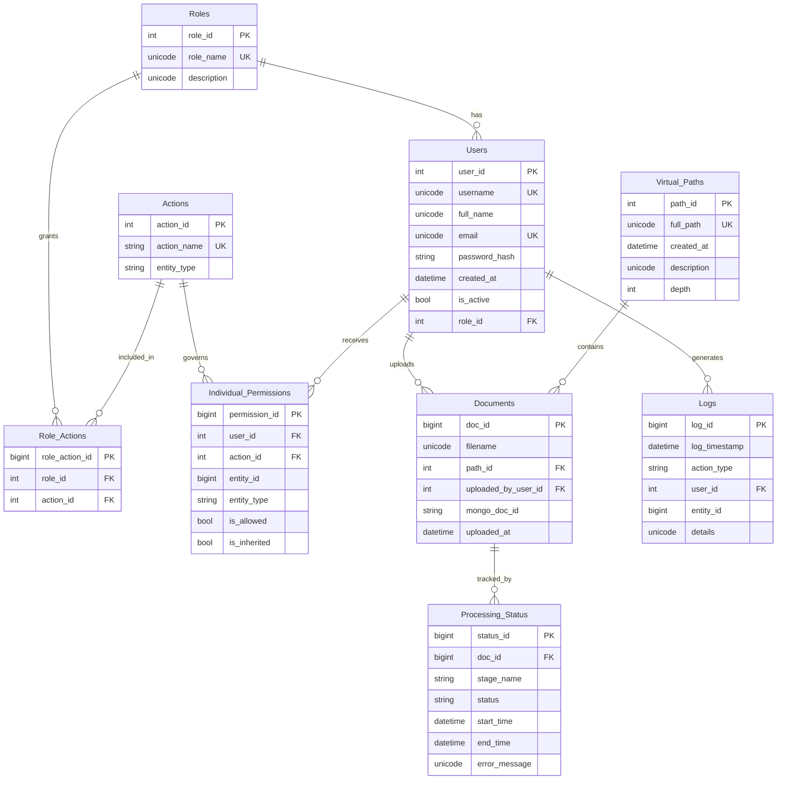
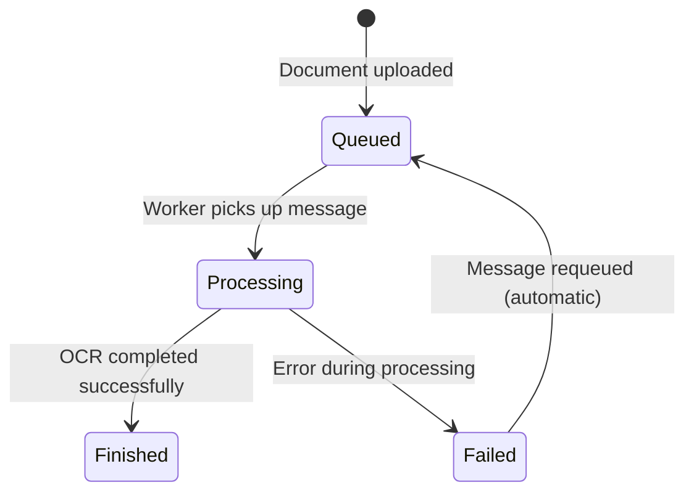

# Database Schema

NassaQ uses **Azure SQL Server** as its primary relational database. The schema is designed around a role-based access control system with document management and audit logging capabilities.

!!! note "Schema Origin"
    The SQLAlchemy ORM models were reverse-engineered from the existing database using `sqlacodegen`. There are no Alembic migrations -- the schema is managed externally via Azure SQL management tools.

---

## Entity Relationship Diagram



---

## Table Descriptions

### Users

The central user table. New users are created as **inactive** (`is_active = false`) with no assigned role. An administrator must activate users and assign them a role before they can access the system.

| Column | Type | Constraints | Description |
|:---|:---|:---|:---|
| `user_id` | `INT` | PK, Identity | Auto-incrementing primary key |
| `username` | `NVARCHAR(50)` | Unique, Not Null | Login username (auto-generated on registration) |
| `full_name` | `NVARCHAR(100)` | Not Null | User's display name |
| `email` | `NVARCHAR(100)` | Unique, Not Null | Email address |
| `password_hash` | `VARCHAR(255)` | Not Null | bcrypt-hashed password |
| `created_at` | `DATETIME` | Not Null, Default: `getdate()` | Account creation timestamp |
| `is_active` | `BIT` | Not Null, Default: `0` | Whether the user can log in |
| `role_id` | `INT` | FK -> Roles, Default: `1` | Assigned role (nullable until activated) |

**Relationships:**

- Belongs to one `Role` (via `role_id`)
- Has many `Documents` (uploaded files)
- Has many `Individual_Permissions` (fine-grained access)
- Has many `Logs` (audit trail)

---

### Roles

Defines the roles available in the system. Role `99` is reserved for **administrators** and is checked at the application level in the FastAPI dependency chain. See the [Security & Auth](../concepts/security.md#role-based-access-control-rbac) page for details on how roles are enforced.

| Column | Type | Constraints | Description |
|:---|:---|:---|:---|
| `role_id` | `INT` | PK, Identity | Auto-incrementing primary key |
| `role_name` | `NVARCHAR(50)` | Unique, Not Null | Human-readable role name |
| `description` | `NVARCHAR(255)` | Nullable | Role description |

**Relationships:**

- Has many `Users` assigned to this role
- Has many `Role_Actions` defining what actions this role can perform

---

### Actions

Represents individual actions that can be performed within the system (e.g., "read", "write", "delete"). Actions are scoped to an `entity_type` (e.g., "document", "user").

| Column | Type | Constraints | Description |
|:---|:---|:---|:---|
| `action_id` | `INT` | PK, Identity | Auto-incrementing primary key |
| `action_name` | `VARCHAR(50)` | Unique, Not Null | Action identifier (e.g., "read", "delete") |
| `entity_type` | `VARCHAR(20)` | Not Null | What type of entity this action applies to |

**Relationships:**

- Included in many `Role_Actions` (role-level permissions)
- Referenced by many `Individual_Permissions` (user-level overrides)

---

### Role_Actions

A **junction table** that maps roles to actions, defining what each role is permitted to do.

| Column | Type | Constraints | Description |
|:---|:---|:---|:---|
| `role_action_id` | `BIGINT` | PK, Identity | Auto-incrementing primary key |
| `role_id` | `INT` | FK -> Roles, Not Null | The role being granted an action |
| `action_id` | `INT` | FK -> Actions, Not Null | The action being granted |

**Unique constraint:** `(role_id, action_id)` -- prevents duplicate grants.

---

### Virtual_Paths

Represents a **virtual folder hierarchy** for organizing documents. Paths are stored as full path strings (e.g., `/department/finance/2024`) with a `depth` field indicating the nesting level.

| Column | Type | Constraints | Description |
|:---|:---|:---|:---|
| `path_id` | `INT` | PK, Identity | Auto-incrementing primary key |
| `full_path` | `NVARCHAR(500)` | Unique, Not Null | Full path string (e.g., `/dept/finance`) |
| `created_at` | `DATETIME` | Not Null, Default: `getdate()` | Path creation timestamp |
| `description` | `NVARCHAR(MAX)` | Nullable | Path description |
| `depth` | `INT` | Not Null | Nesting depth (0 for root-level) |

**Relationships:**

- Contains many `Documents` stored at this path

---

### Documents

Stores metadata for every uploaded document. The actual file content lives in Azure Blob Storage; this table holds the reference.

| Column | Type | Constraints | Description |
|:---|:---|:---|:---|
| `doc_id` | `BIGINT` | PK, Identity | Auto-incrementing primary key |
| `filename` | `NVARCHAR(255)` | Not Null | Original filename |
| `path_id` | `INT` | FK -> Virtual_Paths, Not Null | Virtual folder location |
| `uploaded_by_user_id` | `INT` | FK -> Users, Not Null | User who uploaded the file |
| `mongo_doc_id` | `VARCHAR(36)` | Not Null | Reference to MongoDB document (currently a placeholder UUID) |
| `uploaded_at` | `DATETIME` | Not Null, Default: `getdate()` | Upload timestamp |

**Unique constraint:** `(filename, path_id)` -- prevents duplicate filenames within the same folder.

**Relationships:**

- Belongs to one `Virtual_Path` (folder)
- Belongs to one `User` (uploader)
- Has many `Processing_Status` records (tracks OCR progress)

---

### Processing_Status

Tracks the lifecycle of a document through the OCR processing pipeline. Each record represents a processing stage for a specific document. See the [Processing Pipelines](../guides/ocr-pipelines.md) page for details on how the OCR worker updates these records.

| Column | Type | Constraints | Description |
|:---|:---|:---|:---|
| `status_id` | `BIGINT` | PK, Identity | Auto-incrementing primary key |
| `doc_id` | `BIGINT` | FK -> Documents, Not Null | The document being processed |
| `stage_name` | `VARCHAR(50)` | Not Null | Processing stage (currently always `"OCR"`) |
| `status` | `VARCHAR(20)` | Not Null | Current status of this stage |
| `start_time` | `DATETIME` | Not Null, Default: `getdate()` | When processing began |
| `end_time` | `DATETIME` | Nullable | When processing completed |
| `error_message` | `NVARCHAR(MAX)` | Nullable | Error details if processing failed |

**Status lifecycle:**



---

### Individual_Permissions

Provides **fine-grained, user-level permission overrides** that can grant or deny access to specific entities independently of role-based permissions.

| Column | Type | Constraints | Description |
|:---|:---|:---|:---|
| `permission_id` | `BIGINT` | PK, Identity | Auto-incrementing primary key |
| `user_id` | `INT` | FK -> Users, Not Null | The user this permission applies to |
| `action_id` | `INT` | FK -> Actions, Not Null | The action being permitted/denied |
| `entity_id` | `BIGINT` | Not Null | ID of the specific entity (e.g., a document ID) |
| `entity_type` | `VARCHAR(20)` | Not Null | Type of entity (e.g., "document", "path") |
| `is_allowed` | `BIT` | Not Null | Whether access is granted (`1`) or denied (`0`) |
| `is_inherited` | `BIT` | Not Null, Default: `0` | Whether this permission was inherited from a parent |

!!! warning "Not Yet Active"
    The `Individual_Permissions` table exists in the database schema but is **not yet wired into the API authorization logic**. Currently, all access control is role-based through the `AdminUser` dependency (role_id = 99).

---

### Logs

An **audit log** table that records significant actions performed within the system.

| Column | Type | Constraints | Description |
|:---|:---|:---|:---|
| `log_id` | `BIGINT` | PK, Identity | Auto-incrementing primary key |
| `log_timestamp` | `DATETIME` | Not Null, Default: `getdate()` | When the action occurred |
| `action_type` | `VARCHAR(50)` | Not Null | Type of action (e.g., "upload", "delete", "login") |
| `user_id` | `INT` | FK -> Users, Nullable | The user who performed the action |
| `entity_id` | `BIGINT` | Nullable | ID of the affected entity |
| `details` | `NVARCHAR(MAX)` | Nullable | Free-text details about the action |

---

### sysdiagrams

A **system table** automatically created by SQL Server Management Studio (SSMS) for storing database diagram definitions. This table is not used by the application.

| Column | Type | Constraints | Description |
|:---|:---|:---|:---|
| `diagram_id` | `INT` | PK, Identity | Diagram identifier |
| `name` | `SYSNAME` | Not Null | Diagram name |
| `principal_id` | `INT` | Not Null | Database principal who owns the diagram |
| `version` | `INT` | Nullable | Diagram format version |
| `definition` | `VARBINARY(MAX)` | Nullable | Serialized diagram data |

---

## Access Patterns by Service

The two backend services access different subsets of the database. For details on how the backend server exposes these tables via its REST API, see the [API Reference](../reference/api-endpoints.md).

| Table | Backend Server | OCR Worker |
|:---|:---:|:---:|
| `Users` | Read / Write | -- |
| `Roles` | Read | -- |
| `Role_Actions` | Read | -- |
| `Actions` | Read | -- |
| `Virtual_Paths` | Read / Write | -- |
| `Documents` | Read / Write | Write (`mongo_doc_id`) |
| `Processing_Status` | Read / Create | Write (status updates) |
| `Individual_Permissions` | Read | -- |
| `Logs` | Write | -- |
| `sysdiagrams` | -- | -- |

---

## Connection Configuration

Both services connect using the same driver stack:

```
SQLAlchemy 2.0 (async) -> aioodbc -> pyodbc -> ODBC Driver 18 for SQL Server -> Azure SQL
```

Connection settings are managed via Pydantic Settings and include resilience features:

| Setting | Default | Purpose |
|:---|:---|:---|
| `SQL_CONNECT_TIMEOUT` | `60` seconds | Connection timeout |
| `SQL_MAX_RETRIES` | `3` | Maximum retry attempts on `OperationalError` |
| `SQL_RETRY_DELAY_BASE` | `2` seconds | Base delay for exponential backoff |
| `pool_pre_ping` | `True` | Validates connections before use |
| `pool_recycle` | `1800` seconds (30 min) | Recycles idle connections |

---

## Planned: MongoDB Integration

Azure Cosmos DB with the MongoDB API is planned for storing processed document content (extracted text, embeddings, and structured metadata). See the [Roadmap](../project/roadmap.md#mongodb-migration-for-ocr-output) for the full migration plan. The server's configuration already includes MongoDB connection settings:

| Setting | Description |
|:---|:---|
| `MONGO_USER` | MongoDB username |
| `MONGO_PASS` | MongoDB password (URL-encoded) |
| `MONGO_HOST` | Cosmos DB cluster hostname |
| `MONGO_PORT` | Connection port (default: `10260`) |
| `MONGO_DB_NAME` | Database name (default: `sdmsdb`) |
| `MONGO_TLS_INSECURE` | Allow insecure TLS (default: `true`) |

The OCR worker currently saves extracted text and metadata as local files. The planned migration will write these directly to MongoDB, linking them back to the SQL Server records via `mongo_doc_id`.
