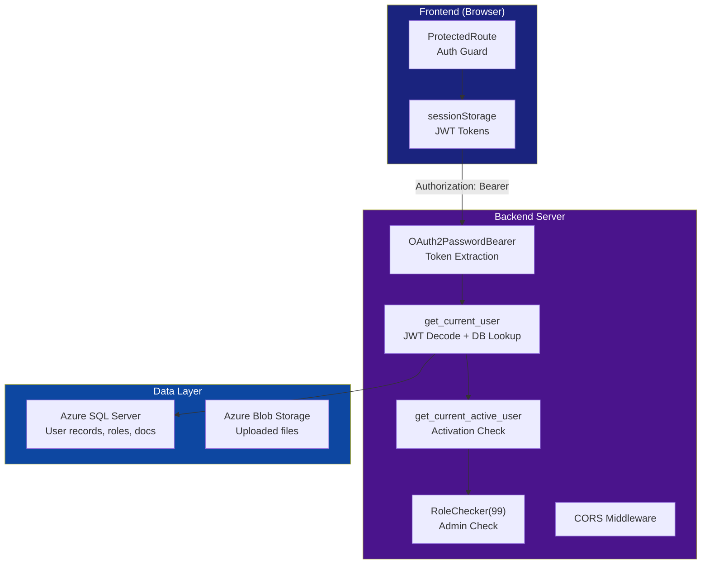
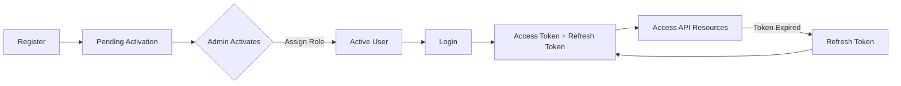
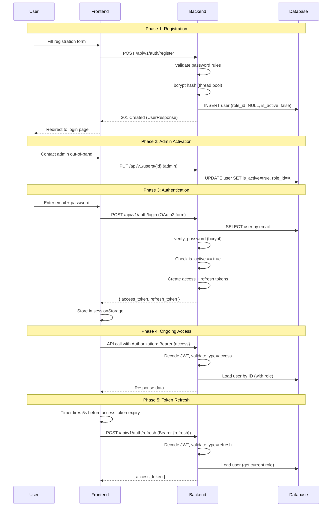
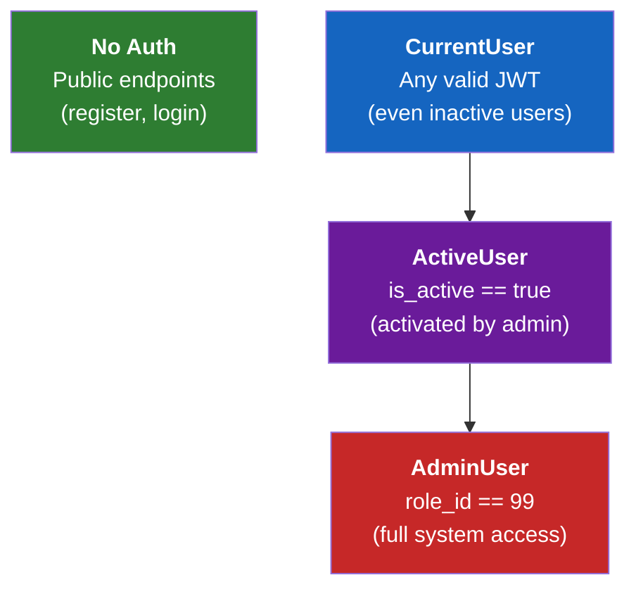

# Security Architecture

End-to-end security model for the NassaQ platform, covering authentication, authorization, data isolation, and security considerations across all services.

For client-side token handling and the frontend integration, see [Frontend API Integration](../guides/frontend-api.md).

## Security Overview



---

## Authentication Flow

### Overview

NassaQ uses a **JWT-based authentication system** with OAuth2 password flow. The system implements a **two-phase onboarding** process: users register freely but must be **activated by an administrator** before they can access protected resources.



### Full Lifecycle



### Key Characteristics

| Property | Value |
|----------|-------|
| **Auth Scheme** | OAuth2 Password Flow |
| **Token Format** | JWT (JSON Web Tokens) |
| **Signing Algorithm** | HS256 (HMAC-SHA256) |
| **Password Hashing** | bcrypt with random salt |
| **Access Token TTL** | Configurable via `ACCESS_TOKEN_EXPIRE_MINUTES` (default: 1 minute) |
| **Refresh Token TTL** | Configurable via `REFRESH_TOKEN_EXPIRE_DAYS` (default: 7 days) |
| **Token Library** | `python-jose[cryptography]` |
| **Hashing Library** | `bcrypt` (via passlib) |

!!! warning "Post-Registration State"
    After registration, the user exists in the database but **cannot log in**. The login endpoint explicitly checks `is_active` and rejects inactive users with a `403 Forbidden` response.

!!! note "OAuth2 Field Naming"
    The OAuth2 password flow requires the email to be sent in the `username` field of the form data. This is an OAuth2 specification requirement.

---

## JWT Token Security

### Token Structure

| Property | Access Token | Refresh Token |
|----------|:--:|:--:|
| Contains user ID (`sub`) | Yes | Yes |
| Contains role ID (`rid`) | Yes | No |
| Short-lived | Yes (configurable, default: 1 min) | No (7 days) |
| Used for API calls | Yes | No |
| Used for refresh | No | Yes |
| Signed with | `JWT_SECRET_KEY` (HS256) | `JWT_SECRET_KEY` (HS256) |

**Access token claims:**

| Claim | Type | Description |
|-------|------|-------------|
| `sub` | `str` | User ID (stringified integer) |
| `rid` | `int` | Role ID (e.g., `99` for admin) |
| `exp` | `datetime` | Expiration timestamp (UTC) |
| `type` | `str` | Always `"access"` |
| `iat` | `datetime` | Issued-at timestamp (UTC) |

**Refresh token claims:** same structure without `rid`. The refresh token does **not** include the role — when a new access token is issued during refresh, the user's current role is fetched fresh from the database. Role changes therefore take effect on the next refresh without requiring re-login.

### Token Differentiation

The `type` claim prevents token misuse:

- **Access tokens** have `"type": "access"` — the `get_current_user` dependency rejects tokens with any other type
- **Refresh tokens** have `"type": "refresh"` — the `/auth/refresh` endpoint rejects tokens with any other type

This prevents using a refresh token to authenticate API calls and vice versa.

### Token Lifetime Strategy

```
┌─────────────────────────────────────────────────────────────┐
│ Access Token: ~1 minute                                     │
│ ┌─────┐ ┌─────┐ ┌─────┐ ┌─────┐ ┌─────┐ ... ┌─────┐      │
│ │ AT1 │ │ AT2 │ │ AT3 │ │ AT4 │ │ AT5 │     │ ATn │      │
│ └─────┘ └─────┘ └─────┘ └─────┘ └─────┘     └─────┘      │
│                                                             │
│ Refresh Token: 7 days                                       │
│ ┌─────────────────────────────────────────────────────────┐ │
│ │                     RT (single)                         │ │
│ └─────────────────────────────────────────────────────────┘ │
└─────────────────────────────────────────────────────────────┘
```

The extremely short access token lifetime (1 minute) minimizes the window of exposure if a token is leaked. The frontend's proactive refresh mechanism ensures seamless UX despite the short TTL.

---

## Password Security

| Property | Value |
|----------|-------|
| Algorithm | bcrypt |
| Salt | Random 128-bit, generated per-password via `bcrypt.gensalt()` |
| Work factor | 12 (default, 2^12 = 4,096 iterations) |
| Salt storage | Embedded in hash output (`$2b$12$...`) |
| Async safety | Hashing runs in thread pool (`run_in_threadpool()`) |

### Validation Rules

Enforced at the Pydantic schema level before the password reaches the hashing function:

| Rule | Constraint |
|------|-----------|
| Minimum length | 8 characters |
| Maximum length | 64 characters |
| Must contain | At least one digit (`0-9`) |
| Must contain | At least one special character (non-alphanumeric) |

---

## Role-Based Access Control (RBAC)

### Role Model

The database stores roles in the `Roles` table, with users referencing roles via `role_id` (see [Database Schema](../concepts/database.md) for full table definitions):

| `role_id` | Role | Access Level |
|:---------:|------|-------------|
| `NULL` | Unassigned | Registered but pending activation |
| `99` | Admin | Full access to all endpoints |
| Other | Custom roles | Standard access (as defined by `Role_Actions` table) |

### Authorization Dependency Chain

FastAPI's dependency injection builds a composable authorization chain. Each level adds a layer of validation on top of the previous one.



| Level | Type Alias | Checks | Failure Response |
|-------|-----------|--------|-----------------|
| Public | — | None | — |
| `CurrentUser` | `Annotated[Users, Depends(get_current_user)]` | Valid JWT, type=access, user exists in DB | `401 Unauthorized` |
| `ActiveUser` | `Annotated[Users, Depends(get_current_active_user)]` | All above + `is_active == True` | `403 Forbidden` |
| `AdminUser` | `Annotated[Users, Depends(RoleChecker(99))]` | All above + `role_id == 99` | `403 Forbidden` |

### Implementation

The dependency chain is implemented in `app/api/deps.py`:

**Level 1 — Token Extraction**

```python
oauth2_scheme = OAuth2PasswordBearer(tokenUrl="/api/v1/auth/login")
TokenDep = Annotated[str, Depends(oauth2_scheme)]
```

FastAPI's `OAuth2PasswordBearer` extracts the token from the `Authorization: Bearer <token>` header. If the header is missing, it returns `401 Unauthorized` automatically.

**Level 2 — `get_current_user` → `CurrentUser`**

```python
async def get_current_user(token: TokenDep, db: DBSession) -> Users:
    payload = decode_token(token)
    if not payload or payload.get("type") != "access":
        raise HTTPException(status_code=401, ...)

    user_id = int(payload.get("sub"))
    user = await db.execute(
        select(Users).options(selectinload(Users.role)).where(Users.user_id == user_id)
    )
    return user.scalar_one_or_none()  # or raise 401

CurrentUser = Annotated[Users, Depends(get_current_user)]
```

Decodes the JWT, verifies `type == "access"`, extracts the user ID, and loads the full user record with eager-loaded role (`selectinload` avoids N+1 queries).

**Level 3 — `get_current_active_user` → `ActiveUser`**

```python
async def get_current_active_user(current_user: CurrentUser) -> Users:
    if current_user.is_active is False:
        raise HTTPException(status_code=403, detail="Your account is pending role assignment...")
    return current_user

ActiveUser = Annotated[Users, Depends(get_current_active_user)]
```

Blocks users who have valid tokens but have been deactivated by an admin.

**Level 4 — `RoleChecker` → `AdminUser`**

```python
class RoleChecker:
    def __init__(self, role_id: int):
        self.role_id = role_id

    def __call__(self, user: ActiveUser) -> Users:
        if user.role_id != self.role_id:
            raise HTTPException(status_code=403, detail="You are not authorized...")
        return user

AdminUser = Annotated[Users, Depends(RoleChecker(role_id=99))]
```

`RoleChecker` is a callable class instantiated with any role ID. Currently only `role_id=99` (admin) is used, but the pattern supports arbitrary role checks.

**Usage in endpoints:**

```python
@router.get("/me")
async def get_me(user: CurrentUser): ...          # Any authenticated user

@router.put("/me")
async def update_me(user: ActiveUser, ...): ...   # Active users only

@router.get("/all")
async def list_all_users(user: AdminUser, ...): ...  # Admin only
```

### Endpoint Authorization Map

See the [API Reference](../reference/api-endpoints.md) for full request/response documentation.

| Endpoint | Auth Level | Notes |
|----------|-----------|-------|
| `POST /auth/register` | None | Anyone can register |
| `POST /auth/login` | None | Returns tokens if credentials valid + active |
| `POST /auth/refresh` | Token (special) | Requires refresh token, not access token |
| `GET /users/me` | CurrentUser | Even inactive users can see their profile |
| `PUT /users/me` | ActiveUser | Must be activated to edit |
| `GET /users/all` | AdminUser | Admin only |
| `GET /users/pending` | AdminUser | Admin only |
| `PUT /users/{id}` | AdminUser | Admin only (role assignment, activation) |
| `DELETE /users/{id}` | AdminUser | Admin only |
| `POST /docs/upload` | ActiveUser | Must be activated |
| `GET /docs/all` | AdminUser | Admin sees all documents |
| `GET /docs/me` | ActiveUser | User sees own documents |
| `GET /docs/{id}/status` | ActiveUser | Check OCR processing status |
| `DELETE /docs/{id}` | ActiveUser | Blocks during processing |
| `GET/POST/PUT/DELETE /paths/*` | ActiveUser | Virtual folder management |

### Configuration

All auth-related settings are loaded from environment variables via Pydantic Settings:

| Variable | Description |
|----------|-------------|
| `JWT_SECRET_KEY` | **Required.** Secret key for signing JWTs. Must be a strong, random value in production. |
| `JWT_ALGORITHM` | Signing algorithm (should be `HS256`). |
| `ACCESS_TOKEN_EXPIRE_MINUTES` | Access token lifetime in minutes (default: `1`). |
| `REFRESH_TOKEN_EXPIRE_DAYS` | Refresh token lifetime in days (default: `7`). |

---

## Data Isolation

### User-Level Isolation

Documents are isolated by `uploaded_by_user_id`:

- **Regular users** can only see their own documents (`GET /docs/me` filters by `current_user.user_id`)
- **Admin users** can see all documents (`GET /docs/all` has no user filter)
- **Delete operations** verify ownership before proceeding

### Virtual Path Isolation

Virtual paths (folders) are user-scoped — each user manages their own path hierarchy, and path operations filter by `user_id`.

### Database-Level

No row-level security (RLS) is implemented at the database level — isolation is enforced at the application layer. All queries include explicit user ID filtering.

---

## Security Considerations

### Current Strengths

| Area | Implementation |
|------|---------------|
| **Password storage** | bcrypt with random salt per-password, work factor 12 |
| **Token separation** | Access and refresh tokens serve different purposes with type enforcement |
| **Short access TTL** | 1-minute lifetime minimizes token theft exposure |
| **Database validation** | Every authenticated request verifies user exists and is active |
| **Thread safety** | bcrypt runs in thread pool to prevent async event loop blocking |
| **Role dynamism** | Role changes take effect on next token refresh (role fetched from DB) |
| **Admin activation** | Two-phase onboarding prevents unauthorized access |

### Known Limitations

| Area | Risk | Mitigation Status |
|------|------|-------------------|
| **No token revocation** | Compromised tokens valid until expiry | Partially mitigated by short access TTL + DB lookup |
| **No refresh rotation** | Leaked refresh token grants 7 days of access | Not mitigated |
| **Single signing key** | Key rotation invalidates all sessions | Not mitigated |
| **No login rate limiting** | Brute-force attacks possible | Not mitigated |
| **No password reset** | Users can't recover accounts without admin | Not implemented |
| **No CSRF protection** | Tokens in sessionStorage (not cookies), so CSRF is not applicable | N/A — not vulnerable |
| **No audit logging** | `Logs` table exists but not populated | Schema ready, implementation pending |
| **Client-side route guards only** | Users could manipulate frontend | Backend validates all requests independently |

### Recommendations for Production

1. **Implement refresh token rotation** — issue a new refresh token on each refresh, invalidating the previous one
2. **Add token revocation** — store active refresh tokens in the database; revoke on logout or password change
3. **Rate limit authentication endpoints** — prevent brute-force attacks on `/auth/login` and `/auth/register`
4. **Implement password reset** — email-based password reset flow with time-limited tokens
5. **Enable CORS restrictions** — restrict `Access-Control-Allow-Origin` to the frontend domain in production
6. **Add audit logging** — populate the `Logs` table with authentication events, admin actions, and data access
7. **Consider asymmetric JWT signing** — RS256 enables public key verification without sharing the signing secret
8. **Implement Content Security Policy** — add CSP headers to prevent XSS in the frontend
