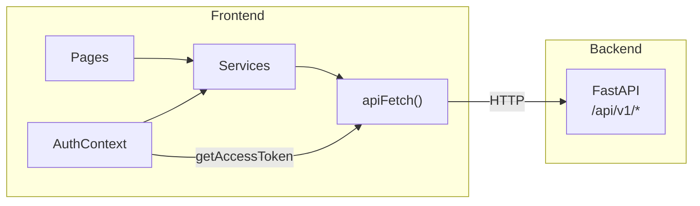
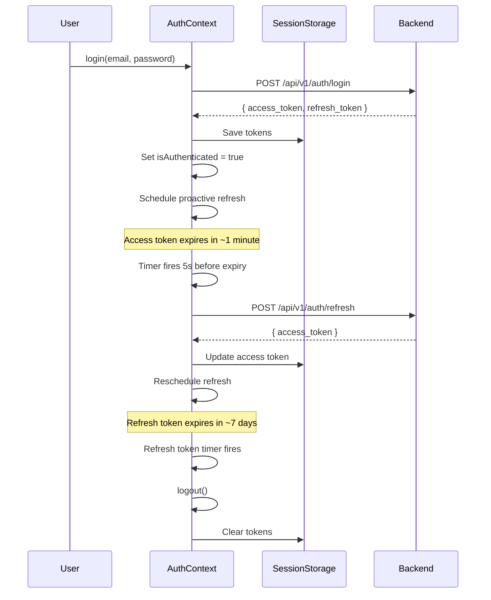

# API Integration

How the frontend communicates with the NassaQ backend server, including the HTTP client, token management, service layer, and current integration status. For the server-side authentication implementation, see the [Security & Auth](../concepts/security.md) page. For the complete API endpoint reference, see the [API Reference](../reference/api-endpoints.md).

## Architecture Overview



The frontend uses a layered approach:

1. **Pages** call **service functions** (e.g., `loginRequest()`, `getCurrentUser()`)
2. **Services** use the `apiFetch()` wrapper to make HTTP requests
3. **AuthContext** manages JWT tokens and provides `getAccessToken()` for authenticated calls
4. `apiFetch()` handles URL construction, response parsing, and error transformation

---

## HTTP Client: `apiFetch()`

The core HTTP wrapper lives in `src/lib/api.ts`:

```typescript
const API_BASE_URL = import.meta.env.VITE_API_BASE_URL ?? "http://127.0.0.1:8000";

export async function apiFetch<T>(
  endpoint: string,
  options: RequestInit = {},
): Promise<T> {
  const url = `${API_BASE_URL}${endpoint}`;
  const res = await fetch(url, { ...options, headers: { ...options.headers } });

  if (!res.ok) {
    // Parse error detail from response body
    throw new ApiRequestError(res.status, detail);
  }

  if (res.status === 204) return undefined as T;
  return res.json() as Promise<T>;
}
```

### Key Design Decisions

| Decision | Rationale |
|----------|-----------|
| Uses native `fetch()` | No external HTTP library needed — Vite provides the polyfill |
| No automatic token attachment | Prevents circular dependencies — the auth layer calls `apiFetch()` too |
| Generic return type `<T>` | Type-safe responses at the call site |
| 204 handling | Returns `undefined` for No Content responses |
| Manual header passing | Each service call explicitly passes `Authorization` and `Content-Type` |

### Error Handling

The `ApiRequestError` class wraps HTTP errors with structured information:

```typescript
export class ApiRequestError extends Error {
  status: number;   // HTTP status code
  detail: string;   // Human-readable error message
}
```

**FastAPI 422 Validation Error Parsing:**

When the backend returns a 422 response (Pydantic validation failure), the error body contains an array of validation errors. `apiFetch()` transforms these into a readable string:

```typescript
// Input: { detail: [{ loc: ["body", "password"], msg: "too short" }] }
// Output: "password: too short"
detail = body.detail.map((err) => {
  const field = err.loc?.slice(-1)[0] ?? "field";
  return `${field}: ${err.msg}`;
}).join("\n");
```

---

## Token Management

### Storage

Tokens are stored in **`sessionStorage`** under the key `__nassaq_tokens`. For a broader view of the security implications, see the [Security Architecture](../concepts/security.md) page.

```typescript
interface Tokens {
  accessToken: string;
  refreshToken: string;
}
```

| Storage | Key | Data |
|---------|-----|------|
| `sessionStorage` | `__nassaq_tokens` | JSON: `{ accessToken, refreshToken }` |

!!! info "Why sessionStorage?"
    Using `sessionStorage` instead of `localStorage` means tokens are automatically cleared when the browser tab is closed. This provides a slight security improvement — tokens don't persist across sessions — at the cost of requiring re-login in new tabs.

### Token Lifecycle



!!! info "Server-side half"
    The diagram above shows the frontend token lifecycle. For how the backend issues, validates, and rotates these tokens (JWT claim structure, FastAPI DI chain, rotation policy), see the [Security & Auth](../concepts/security.md#token-lifecycle--rotation) page.

### Proactive Refresh

The `AuthContext` implements proactive token refresh — it refreshes the access token **5 seconds before it expires**, without waiting for an API call to fail:

```typescript
useEffect(() => {
  if (!tokens?.accessToken) return;

  const payload = decodePayload(tokens.accessToken);
  const expiresIn = payload.exp * 1000 - Date.now();
  const refreshIn = Math.max(expiresIn - 5_000, 0);  // 5s before expiry

  const timer = setTimeout(() => {
    getAccessToken();  // triggers refresh
  }, refreshIn);

  return () => clearTimeout(timer);
}, [tokens?.accessToken, getAccessToken]);
```

### Concurrent Refresh Mutex

When multiple components call `getAccessToken()` simultaneously (e.g., during page load), a **mutex pattern** prevents duplicate refresh requests:

```typescript
const refreshPromiseRef = useRef<Promise<string | null> | null>(null);

const getAccessToken = useCallback(async () => {
  if (!isTokenExpiringSoon(current.accessToken)) {
    return current.accessToken;  // Still valid
  }

  // De-duplicate: reuse the in-flight refresh promise
  if (!refreshPromiseRef.current) {
    refreshPromiseRef.current = refreshAccessToken().finally(() => {
      refreshPromiseRef.current = null;
    });
  }
  return refreshPromiseRef.current;
}, [refreshAccessToken]);
```

### Auto-Logout

Two automatic logout triggers:

1. **Refresh token expiry** — a `setTimeout` is set to the refresh token's remaining lifetime. When it fires, `logout()` is called.
2. **Refresh failure** — if the refresh API returns `401`, the user is logged out immediately.

---

## JWT Decoding

The frontend decodes JWT payloads **client-side** (without verification — that's the server's responsibility) to read expiration times:

```typescript
function decodePayload(token: string): Record<string, unknown> | null {
  try {
    const base64 = token.split(".")[1];
    return JSON.parse(atob(base64));
  } catch {
    return null;
  }
}
```

This is used by:

- `isTokenExpiringSoon(token, bufferMs)` — checks if `exp * 1000 - Date.now() < bufferMs`
- Proactive refresh scheduling
- Auto-logout timer for refresh token expiry

---

## Service Layer

API calls are organized into service files that handle request construction and type definitions. For the page components that consume these services, see the [Components & Flows](../guides/frontend-components.md) page. For project configuration, see the [Setup](../setup/frontend.md) page.

### Auth Service (`src/services/auth.service.ts`)

| Function | Method | Endpoint | Content-Type | Description |
|----------|--------|----------|-------------|-------------|
| `loginRequest(credentials)` | POST | `/api/v1/auth/login` | `x-www-form-urlencoded` | OAuth2 password flow |
| `refreshRequest(refreshToken)` | POST | `/api/v1/auth/refresh` | `application/json` | Exchange refresh token for new access token |
| `registerRequest(data)` | POST | `/api/v1/auth/register` | `application/json` | Create new user account |

**Login request format** (OAuth2 password flow):

```typescript
const body = new URLSearchParams();
body.append("username", credentials.email);  // OAuth2 spec: email goes in 'username'
body.append("password", credentials.password);
```

**Refresh request format:**

```typescript
headers: {
  "Content-Type": "application/json",
  Authorization: `Bearer ${refreshToken}`,
}
```

### Users Service (`src/services/users.service.ts`)

| Function | Method | Endpoint | Description |
|----------|--------|----------|-------------|
| `getCurrentUser(accessToken)` | GET | `/api/v1/users/me` | Fetch authenticated user profile |
| `updateCurrentUser(accessToken, data)` | PATCH | `/api/v1/users/me` | Update full_name and username |

Both functions manually pass the access token in the `Authorization` header:

```typescript
export function getCurrentUser(accessToken: string): Promise<User> {
  return apiFetch<User>("/api/v1/users/me", {
    headers: { Authorization: `Bearer ${accessToken}` },
  });
}
```

### TypeScript Interfaces

The request/response types (`TokenLogin`, `TokenRefresh`, `LoginCredentials`, `RegisterData`, `User`, `UserUpdate`) are defined in the service files at `src/services/auth.service.ts` and `src/services/users.service.ts` — refer to those files for the current shape.

---

## Integration Status

### Connected to Backend

| Feature | Page/Component | Backend Endpoint |
|---------|---------------|-----------------|
| User login | Login page | `POST /api/v1/auth/login` |
| User registration | Register page | `POST /api/v1/auth/register` |
| Token refresh | AuthContext (automatic) | `POST /api/v1/auth/refresh` |
| View profile | Profile page | `GET /api/v1/users/me` |
| Edit profile | Profile page | `PATCH /api/v1/users/me` |
| User avatar initials | DashboardLayout | `GET /api/v1/users/me` |

### Not Yet Connected (Mock Data)

| Feature | Page | Backend Endpoints Available |
|---------|------|----------------------------|
| Dashboard stats | Dashboard | None (no stats endpoint exists) |
| Document upload | — | `POST /api/v1/docs/upload` |
| Document list | History | `GET /api/v1/docs/me`, `GET /api/v1/docs/all` |
| Document status | History | `GET /api/v1/docs/{doc_id}/status` |
| Document delete | History | `DELETE /api/v1/docs/{doc_id}` |
| User management | Users | `GET /api/v1/users/all`, `PUT /api/v1/users/{id}`, etc. |
| Virtual paths | — | `GET/POST/PUT/DELETE /api/v1/paths/*` |
| AI Studio | Studio | No backend endpoint exists |
| Settings | Settings | No backend endpoint exists |
| Billing | Billing | No backend endpoint exists |

### TanStack React Query

`@tanstack/react-query` is installed and configured in the provider hierarchy (`QueryClientProvider` wraps the entire app), but **no pages currently use it**. All API calls use direct `apiFetch()` calls within `useEffect` hooks or event handlers. See the [Roadmap](../project/roadmap.md#tanstack-react-query-migration) for migration plans.

This is an opportunity for improvement — React Query would provide:

- Automatic caching and deduplication
- Background refetching
- Loading/error states without manual `useState`
- Optimistic updates

---

## Error Handling in Pages

Pages handle API errors by catching `ApiRequestError` instances:

```tsx
try {
  await login({ email, password });
  navigate("/dashboard");
} catch (err) {
  if (err instanceof ApiRequestError) {
    setError(err.detail);  // Show backend error message
  } else {
    setError("An unexpected error occurred. Please try again.");
  }
}
```

Errors are displayed inline using styled error containers:

```tsx
{error && (
  <div className="rounded-lg border border-destructive/50 
                  bg-destructive/10 p-3 text-sm text-destructive">
    {error}
  </div>
)}
```
