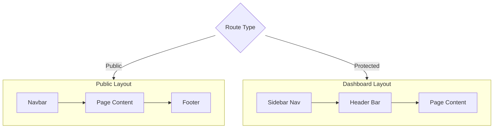
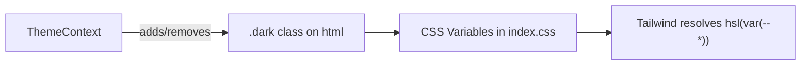
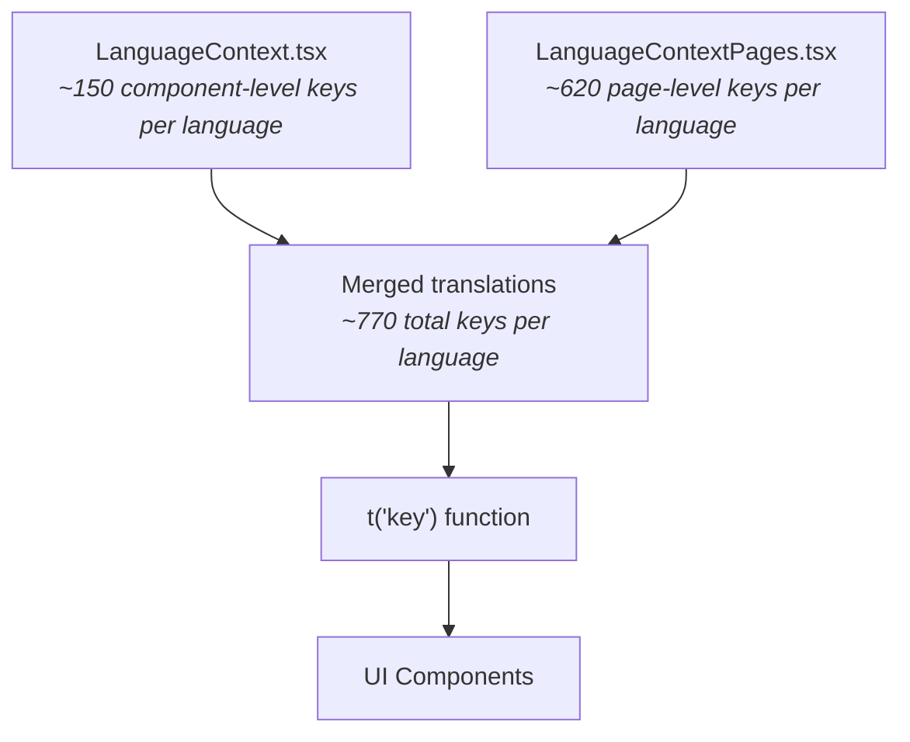

# Components & Flows

Documentation of the key UI components, page architecture, animation system, and the bilingual internationalization system. For project setup and configuration, see the [Setup](../setup/frontend.md) page. For API communication details, see the [API Integration](../guides/frontend-api.md) page.

## Layout Architecture

The application uses two distinct layout patterns depending on whether the user is viewing public marketing pages or authenticated dashboard pages.



### Public Layout

Public pages (`/`, `/about`, `/pricing`, `/contact`) compose a shared visual structure:

| Component | File | Description |
|-----------|------|-------------|
| `Navbar` | `src/components/Navbar.tsx` | Sticky nav with scroll-aware background transition, desktop links + mobile hamburger menu with `AnimatePresence` |
| `Footer` | `src/components/Footer.tsx` | 4-column footer (Product, Company, Resources, Legal) with social links |

The landing page (`Index.tsx`) additionally includes these section components:

| Component | File | Description |
|-----------|------|-------------|
| `Hero` | `src/components/Hero.tsx` | Hero section with gradient blobs, dashboard preview image, CTA buttons |
| `Features` | `src/components/Features.tsx` | 6-card feature grid (AI, Speed, Security, Analytics, Team, Global) |
| `HowItWorks` | `src/components/HowItWorks.tsx` | 4-step process (Connect, Process, Insights, Action) with connector lines |
| `CTA` | `src/components/CTA.tsx` | Call-to-action section with animated gradient background |

### Dashboard Layout

All authenticated pages are wrapped in `DashboardLayout` (`src/components/DashboardLayout.tsx`), which provides:

- **Fixed sidebar** (hidden on mobile, slide-in overlay on toggle)
- **Sticky header** with page title, subtitle, theme/language toggles, and user avatar
- **User initials display** — fetches current user profile on mount via `getCurrentUser()`

**Sidebar Navigation Items:**

| Icon | Label Key | Route |
|------|-----------|-------|
| LayoutDashboard | `dashboard.layout.nav.dashboard` | `/dashboard` |
| Sparkles | `dashboard.layout.nav.studio` | `/studio` |
| History | `dashboard.layout.nav.history` | `/history` |
| Users | `dashboard.layout.nav.users` | `/users` |
| User | `dashboard.layout.nav.profile` | `/profile` |
| Settings | `dashboard.layout.nav.settings` | `/settings` |
| CreditCard | `dashboard.layout.nav.billing` | `/billing` |
| HelpCircle | `dashboard.layout.nav.help` | `/support` |

Active route highlighting uses `location.pathname` comparison with primary-colored backgrounds.

---

## Route Protection

The `ProtectedRoute` component (`src/components/ProtectedRoute.tsx`) wraps all dashboard routes:

```typescript
const ProtectedRoute = ({ children }: { children: React.ReactNode }) => {
  const { isAuthenticated } = useAuth();
  if (!isAuthenticated) {
    return <Navigate to="/login" replace />;
  }
  return <>{children}</>;
};
```

When `isAuthenticated` is `false` (no access token in memory), the user is redirected to `/login`. The `replace` prop prevents the protected route from appearing in browser history.

---

## Page Components

### Pages with Real API Integration

These pages connect to the backend server via the service layer. For the full list of backend endpoints, see the [API Reference](../reference/api-endpoints.md). For details on the server-side authentication flow, see the [Security & Auth](../concepts/security.md) page.

| Page | File | API Calls |
|------|------|-----------|
| **Login** | `src/pages/Login.tsx` | `useAuth().login()` → `POST /api/v1/auth/login` |
| **Register** | `src/pages/Register.tsx` | `registerRequest()` → `POST /api/v1/auth/register` |
| **Profile** | `src/pages/Profile.tsx` | `getCurrentUser()` → `GET /api/v1/users/me`; `updateCurrentUser()` → `PATCH /api/v1/users/me` |

The `DashboardLayout` also calls `getCurrentUser()` on mount to display the user's initials in the sidebar avatar.

### Pages with Mock/Hardcoded Data

These pages have full UI implementations but use hardcoded data — backend integration is not yet implemented:

| Page | File | Mock Data |
|------|------|-----------|
| **Dashboard** | `src/pages/Dashboard.tsx` | Stats cards (documents processed, storage used, etc.), quick actions, recent activity list |
| **Studio** | `src/pages/Studio.tsx` | AI content generation interface with mode selector (Document/Chat/Image/Code), template picker, input/output panels |
| **History** | `src/pages/History.tsx` | Document list with search, filter pills (All/Completed/Processing/Failed), table + mobile card views |
| **Users** | `src/pages/Users.tsx` | Full user management: search, role filter, status tabs, paginated table with bulk select/delete, side sheet for editing |
| **Settings** | `src/pages/Settings.tsx` | Notification toggles, appearance (dark mode, reduce motion), language, security sections, danger zone |
| **Billing** | `src/pages/Billing.tsx` | Current plan display, usage progress bars, plan comparison grid (Starter/Professional/Enterprise), invoice history |

### Static Content Pages

| Page | File | Description |
|------|------|-------------|
| **About** | `src/pages/About.tsx` | Team member photos (9 members), company values, story sections |
| **Pricing** | `src/pages/Pricing.tsx` | Public pricing with monthly/annual toggle, 3-tier comparison |
| **Contact** | `src/pages/Contact.tsx` | Contact form with Zod validation, contact info cards, office hours |
| **Support** | `src/pages/Support.tsx` | Searchable FAQ accordion with `AnimatePresence`, resource cards |
| **NotFound** | `src/pages/NotFound.tsx` | Simple 404 page |

---

## Theme System

### ThemeContext

The theme system (`src/context/ThemeContext.tsx`) implements a light/dark toggle using the **class strategy**:



| Feature | Implementation |
|---------|---------------|
| **Storage** | `localStorage` (key: theme preference) |
| **Mechanism** | Adds/removes `dark` class on `document.documentElement` |
| **Default** | Light mode |
| **Hook** | `useTheme()` → `{ theme, toggleTheme }` |

### ThemeToggle

The `ThemeToggle` component (`src/components/ThemeToggle.tsx`) renders an animated button that rotates between Sun and Moon icons using Framer Motion.

### CSS Design System

All theme colors are defined as HSL CSS custom properties in `src/index.css`:

```css
:root {
  --primary: 237 92% 62%;        /* Blue */
  --accent: 262 83% 58%;          /* Purple */
  --background: 0 0% 100%;        /* White */
  --foreground: 222 47% 11%;      /* Dark navy */
  /* ... 12 more tokens */
}

.dark {
  --background: 222 47% 11%;      /* Dark navy */
  --foreground: 210 40% 98%;      /* Off-white */
  /* ... overrides for all tokens */
}
```

Tailwind resolves these via the config: `primary: "hsl(var(--primary))"`, ensuring all components automatically adapt to the active theme.

---

## Internationalization (i18n)

NassaQ implements a custom i18n system supporting **English (EN)** and **Arabic (AR)** with full RTL support.

### Architecture



The translation system is split across two files:

| File | Scope | Key Count (per language) |
|------|-------|--------------------------|
| `LanguageContext.tsx` | Shared components (Navbar, Hero, Footer, DashboardLayout, toggles) | ~150 |
| `LanguageContextPages.tsx` | Page-specific content (all 15 pages) | ~620 |

Total: approximately **1,540 translation entries** (770 keys x 2 languages).

### How It Works

1. **Language stored in `localStorage`** — persists across sessions
2. **RTL handling** — when Arabic is selected, sets `document.documentElement.dir = "rtl"`
3. **Translation function** — `t(key)` performs dot-notation lookup on the merged translations object
4. **Namespace convention** — keys are organized by component/page:

```
brand.name                      → "NassaQ"
nav.home                        → "Home" / "الرئيسية"
pages.login.title               → "Welcome Back" / "مرحبًا بعودتك"
pages.dashboard.stats.documents → "Total Documents" / "إجمالي المستندات"
dashboard.layout.nav.studio     → "AI Studio" / "استوديو الذكاء"
```

### Usage in Components

Every visible string in the application uses the `t()` function:

```tsx
const { t } = useLanguage();

return (
  <h1>{t("pages.login.title")}</h1>
  <p>{t("pages.login.subtitle")}</p>
  <Button>{t("pages.login.form.submit")}</Button>
);
```

### LanguageToggle

The `LanguageToggle` component (`src/components/LanguageToggle.tsx`) renders a Globe icon button that toggles between `en` and `ar`. The toggle label displays `"EN"` or `"AR"` next to the icon.

### RTL Support

When Arabic is selected:

- `document.documentElement.dir` is set to `"rtl"`
- The browser's native RTL rendering handles text alignment, flex direction, and margin/padding mirroring
- Tailwind's RTL utilities are available for cases needing explicit override

---

## Animation System

Framer Motion is used extensively throughout the application. Every page and most components include entry animations.

### Common Patterns

**Page entry animation** (used on every page):

```tsx
<motion.div
  initial={{ opacity: 0, y: 20 }}
  animate={{ opacity: 1, y: 0 }}
  transition={{ duration: 0.6 }}
>
  {/* Page content */}
</motion.div>
```

**Staggered children** (used in feature grids, card lists):

```tsx
<motion.div
  initial={{ opacity: 0, y: 20 }}
  animate={{ opacity: 1, y: 0 }}
  transition={{ duration: 0.4, delay: index * 0.1 }}
>
```

**AnimatePresence** (used for conditional rendering with exit animations):

```tsx
<AnimatePresence>
  {isOpen && (
    <motion.div
      initial={{ height: 0, opacity: 0 }}
      animate={{ height: "auto", opacity: 1 }}
      exit={{ height: 0, opacity: 0 }}
    >
      {/* Expandable content */}
    </motion.div>
  )}
</AnimatePresence>
```

### Components Using Framer Motion

| Component | Animation Type |
|-----------|---------------|
| All 15 pages | Entry fade-in + slide-up |
| `Navbar` | Mobile menu `AnimatePresence`, active link `layoutId` animation |
| `Hero` | Animated gradient blobs, scroll indicator |
| `Features` | Staggered card entry, hover scale |
| `HowItWorks` | Sequential step reveal |
| `CTA` | Animated gradient background blobs |
| `ThemeToggle` | Rotating icon transition |
| `DashboardLayout` | Sidebar slide-in on mobile |
| `Support` (FAQ) | `AnimatePresence` accordion expand/collapse |
| `Profile` | Card entry animations, edit mode transitions |

---

## shadcn/ui Components

The project includes **50 shadcn/ui components** in `src/components/ui/` — check that directory for the full list. They are standard, unmodified shadcn/ui components built on Radix UI primitives (accordion, dialog, dropdown-menu, select, tabs, toast, etc.) plus several non-Radix ones (calendar via `react-day-picker`, carousel via `embla-carousel-react`, chart via `recharts`, command via `cmdk`, drawer via `vaul`, form via `react-hook-form`, and more). See [Setup → shadcn/ui](../setup/frontend.md#shadcnui-setup) for the `components.json` configuration.

---

## Utility Functions

### `cn()` — Class Name Utility

Located at `src/lib/utils.ts`:

```typescript
import { clsx, type ClassValue } from "clsx";
import { twMerge } from "tailwind-merge";

export function cn(...inputs: ClassValue[]) {
  return twMerge(clsx(inputs));
}
```

Combines `clsx` (conditional classes) with `tailwind-merge` (intelligent deduplication of Tailwind classes). Used throughout all components for dynamic className composition.

### `useIsMobile()` — Mobile Detection

Located at `src/hooks/use-mobile.tsx`:

```typescript
const MOBILE_BREAKPOINT = 768;
```

Uses `window.matchMedia` to reactively detect mobile viewports. Returns `boolean`.
