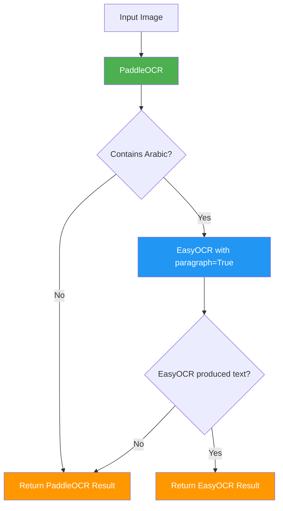
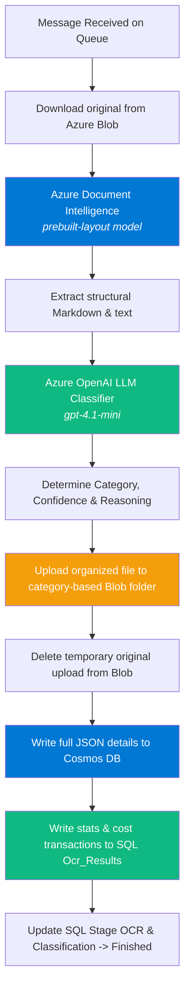

# Processing Pipelines

The NassaQ platform provides two distinct, state-of-the-art processing pipelines depending on your organizational needs: the **Self-Hosted Local Pipeline** and the **AI Foundry Cloud Ingestion Pipeline**. This page documents the operational logic, processing stages, and architecture of both pipelines.

---

## 1. Self-Hosted Local Ingestion Pipeline

The **Self-Hosted Local Pipeline** utilizes open-source machine learning models executing on your own CPU or GPU infrastructure. It is optimized for 100% data residency and offline deployment.

### Smart OCR Router

The local worker implements a two-stage routing pipeline: it runs PaddleOCR first (highly optimized for speed and Latin layouts), analyzes the text, and fallback-routes to EasyOCR if Arabic characters are detected.



### Why Two Engines?

| Engine | Strengths | Weaknesses |
|--------|-----------|------------|
| **PaddleOCR** | Fast; superior on English/Latin text, numeric matrices, and complex tables | Disjointed letters and incorrect right-to-left layout reconstruction for Arabic cursives |
| **EasyOCR** | Excellent Arabic script recognition with `paragraph=True` for RTL layout recovery | Slower, especially on CPU resources |

The smart router runs a simple regex character-range check on Paddle's output to find Arabic text (Unicode range: `U+0600` to `U+06FF`). If found, it routes the page to EasyOCR's reader.

### PDF & Image Processing

- **PDF Documents**: Uses a **three-tier extraction strategy** per page.
    1. **Tier 1 (Embedded Text)**: Direct digital text layer extraction via PyMuPDF (`page.get_text()`).
    2. **Tier 2 (Embedded Images)**: Locates embedded images within the PDF, extracts raw bytes, decodes them with OpenCV, and processes them through the smart OCR router.
    3. **Tier 3 (Full-Page OCR)**: If no digital text or embedded images are found (e.g., scanned documents), renders the entire page to a high-resolution pixmap and routes it through the smart OCR router.
- **Images (JPEG/PNG)**: Decodes raw image buffers into OpenCV BGR formats and processes them directly via the smart OCR router.
- **Text Files**: Directly decodes content from UTF-8 without running any OCR engines.

### Storage & Local Output

Extracted text and structural metadata are saved on the local worker's disk under `OUTPUT_DIR` in three files:
- **Source Copy**: `{timestamp}_SOURCE_{filename}` (original file).
- **Text File**: `{timestamp}_TARGET_{filename}.txt` (extracted plain text).
- **Metadata JSON**: `Details_{timestamp}_{filename}.json` (confidence score logs, pages, and model routing timeline).

---

## 2. AI Foundry Cloud Ingestion Pipeline

The **AI Foundry Cloud Ingestion Pipeline** is a premium, enterprise-tier pipeline utilizing Microsoft Azure's cloud cognitive models. It delivers advanced layouts, automated categorization, and deep database integrations.



### Stage 1: Document Intelligence Layout Extraction

When a file is picked up by the AI Foundry worker, it downloads the file from Azure Blob Storage and forwards it to the **Azure Document Intelligence** endpoint.
- **Model**: `prebuilt-layout`
- **Configuration**: `high_resolution=True`, `locale="ar"`, `output_format="markdown"`
- **Result**: Document layout (headers, footers, paragraphs, text styles) is accurately preserved. **Tables** are parsed and written directly into clean, standardized Markdown tables instead of getting flattened into raw strings.

### Stage 2: AI Classification & Automated Directory Organization

The extracted plain text is evaluated by **Azure OpenAI** (`gpt-4.1-mini`) for classification.
- **Input**: Extracted text is fed to the LLM with a strict system prompt containing predefined organizational categories (e.g. `Invoice`, `Report`, `Contract`, `Official Letter`, `Resume`).
- **Response**: The model returns a structured JSON payload containing:
    - `category`: The designated class name.
    - `confidence`: Classification confidence percentage (0.0 to 1.0).
    - `reasoning`: A detailed multi-line explanation of the classification decision.
- **Blob Auto-Organization**: If the classification is highly confident, the worker automatically re-uploads the document to Azure Blob Storage under a category-partitioned directory (e.g., `invoice/bill_99.pdf` or `contract/lease.pdf`) and deletes the temporary, loose file.

### Stage 3: Cosmos DB (NoSQL Layout Persistence)

Instead of saving flat files on disk, the premium pipeline commits the entire document record to **Azure Cosmos DB** (MongoDB API). This allows NassaQ to perform queries, structured indexing, and full-text searches.

**Cosmos Document Schema Example:**
```json
{
    "_id": ObjectId("64f5a..."),
    "doc_id": 42,
    "filename": "monthly_report.pdf",
    "file_type": ".pdf",
    "blob_path": "report/monthly_report.pdf",
    "extracted_text": "# Monthly Report\n...",
    "ocr": {
        "page_count": 5,
        "word_count": 1420,
        "avg_confidence": 0.98,
        "primary_language": "ar",
        "cost_usd": 0.05,
        "elapsed_seconds": 3.2,
        "chunks_used": 12
    },
    "classification": {
        "category": "Report",
        "confidence": 0.99,
        "reasoning": "The document contains corporate updates and data tables...",
        "tokens_used": 850,
        "cost_usd": 0.0012,
        "error": null
    },
    "processed_at": "2026-05-31T17:28:53Z"
}
```

### Stage 4: SQL Server Transactional Metric Sync

The worker updates the core database tables to reflect processing success. Specifically, it writes transactional stats to the SQL `Ocr_Results` table, linking it back to the `Documents` table via `doc_id`.

**SQL Sync Fields:**
- `page_count` & `word_count`: Extracted dimensions.
- `avg_confidence`: Document text extraction confidence.
- `primary_language`: Automatically identified language code.
- `category` & `classification_confidence`: Categorization metrics.
- `cost_usd_ocr`: Exact Azure Document Intelligence transaction cost based on page volume.
- `cost_usd_classification`: Exact Azure OpenAI token consumption costs.
- `processed_at`: Ingestion completion timestamp.

By offloading heavy OCR texts to Cosmos DB while preserving key transactional metrics in SQL Server, NassaQ maintains a highly performant and auditable relational core.
