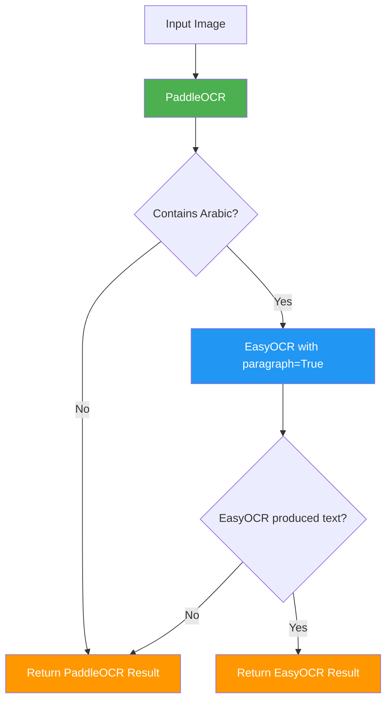
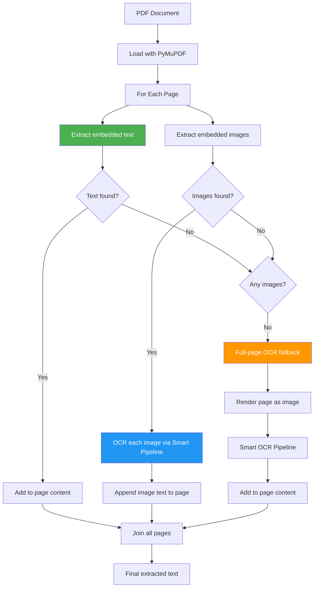
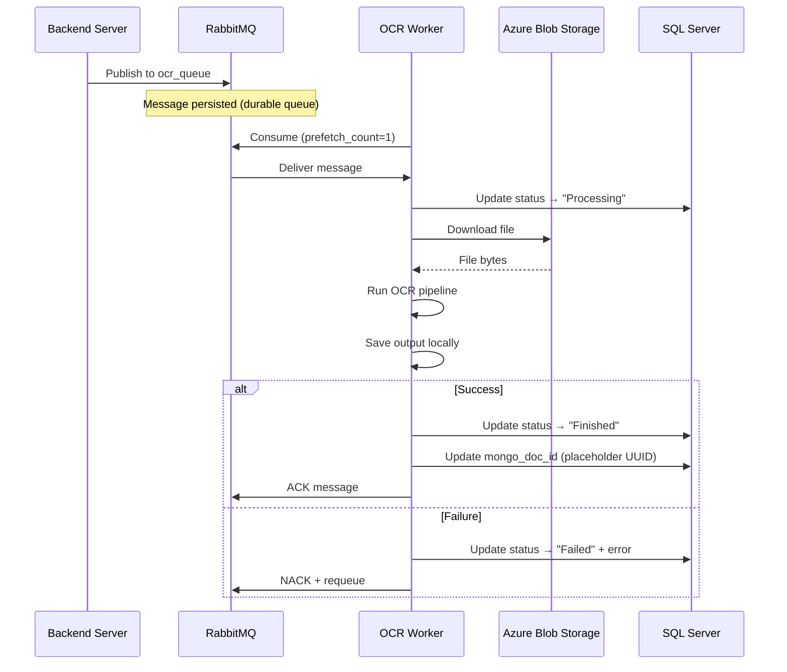
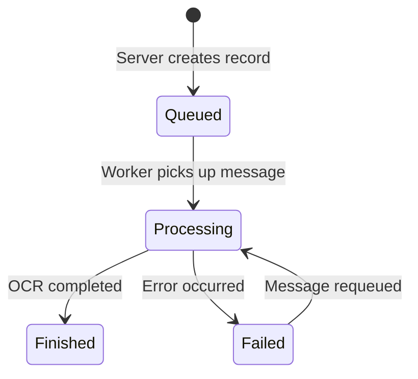

# Processing Pipelines

The OCR worker implements a **smart routing pipeline** that automatically detects document language and selects the optimal OCR engine. This page documents the pipeline logic, PDF/image processing, and the RabbitMQ-based async architecture. For environment setup and configuration, see the [OCR API Setup](../setup/ocr-worker.md) page.

## Smart OCR Router

The core innovation is a two-stage language detection approach: run PaddleOCR first (fast), then check for Arabic text and switch to EasyOCR if needed.



### Why Two Engines?

| Engine | Strengths | Weaknesses |
|--------|-----------|------------|
| **PaddleOCR** | Very fast, excellent for English/numbers/tables | Arabic text often appears with disjointed letters and wrong reading order |
| **EasyOCR** | Accurate Arabic with `paragraph=True` for correct RTL reconstruction | Slower, especially on CPU |

The smart router gives you the best of both: PaddleOCR's speed for English content, with automatic fallback to EasyOCR's accuracy for Arabic content.

### Language Detection

Arabic text is detected using a simple Unicode range check:

```python
def contains_arabic(text: str) -> bool:
    """Checks if text contains Arabic characters (Unicode range: U+0600-U+06FF)."""
    arabic_pattern = re.compile(r"[\u0600-\u06FF]")
    return bool(arabic_pattern.search(text))
```

The Unicode block `U+0600`--`U+06FF` covers the Arabic script used in Arabic, Persian, Urdu, and related languages.

### Pipeline Function

The `smart_ocr_pipeline` function in `app/api/deps.py` orchestrates the routing:

```python
def smart_ocr_pipeline(paddle_engine, easy_engine, img_array) -> Tuple[str, float, str]:
    """Returns (extracted_text, confidence_score, model_name)."""

    text, conf = ocr_with_paddle(paddle_engine, img_array)
    used_model = "paddle"

    if contains_arabic(text):
        easy_text, easy_conf = ocr_with_easy(easy_engine, img_array)
        if easy_text.strip():
            return easy_text, easy_conf, "easyocr (auto-switched)"

    return text, conf, used_model
```

### PaddleOCR Processing

PaddleOCR returns results in different formats depending on the version. The worker handles both:

- **Dict format** (newer): `{"rec_texts": [...], "rec_scores": [...]}`
- **List format** (legacy): `[[bbox, (text, confidence)], ...]`

The confidence score is the average of all detected text regions.

### EasyOCR Processing

EasyOCR is called with `paragraph=True`, which is critical for Arabic text:

- Groups nearby text detections into paragraphs
- Maintains correct right-to-left reading order
- Handles cursive Arabic script connectivity

The confidence score for EasyOCR is set to `0.95` when text is detected (EasyOCR's paragraph mode doesn't return per-word confidence).

## Document Processing

The worker handles three document types, each with a different processing strategy.

### Supported File Types

| Extension | Type | Processing Method |
|-----------|------|-------------------|
| `.pdf` | PDF Document | Multi-strategy extraction |
| `.jpg`, `.jpeg`, `.png` | Image | Direct OCR |
| `.txt` | Plain Text | Direct read (no OCR) |

### PDF Processing Pipeline

PDFs receive the most sophisticated handling with a **three-tier extraction strategy** applied per page:



**Tier 1 -- Embedded Text:** Uses `page.get_text()` to extract any text layer directly. This handles digital/native PDFs with no OCR needed.

**Tier 2 -- Embedded Images:** Uses `page.get_images()` to find images embedded in the page. Each image is extracted, decoded with OpenCV, and run through the smart OCR pipeline.

**Tier 3 -- Full-Page OCR:** If a page has neither text nor images (e.g., a scanned document), the entire page is rendered as a pixmap and processed through the smart OCR pipeline.

Pages are joined with `-------------------` separators in the final output.

### Image Processing

Images (JPEG, PNG) are processed directly:

1. Decode raw bytes to a NumPy array via `np.frombuffer`
2. Convert to OpenCV BGR format via `cv2.imdecode`
3. Run through the smart OCR pipeline
4. Return extracted text and metadata

### Text File Processing

Plain text files are simply decoded from UTF-8. No OCR is needed:

```python
def process_text_file(file_content: bytes) -> tuple[str, dict]:
    text = file_content.decode("utf-8")
    metadata = {"page": 1, "method": "Direct Read", "confidence": 1.0}
    return text, metadata
```

## RabbitMQ Consumer Architecture

The OCR worker operates as an **async message consumer**, processing documents published by the backend server.

### Message Flow



### Message Format

Messages published to `ocr_queue` follow this structure:

```json
{
    "doc_id": 42,
    "file_path": "https://account.blob.core.windows.net/container/path/file.pdf",
    "filename": "report.pdf",
    "user_id": 7
}
```

| Field | Type | Description |
|-------|------|-------------|
| `doc_id` | `int` | Document ID in the SQL Server `Documents` table |
| `file_path` | `str` | Azure Blob Storage URL or path to the uploaded file |
| `filename` | `str` | Original filename (used for extension detection) |
| `user_id` | `int` | ID of the user who uploaded the document |

### Consumer Configuration

| Setting | Value | Purpose |
|---------|-------|---------|
| `prefetch_count` | `1` | Process one message at a time (prevents overload) |
| Queue durability | `durable=True` | Messages survive broker restarts |
| Delivery mode | `PERSISTENT` | Messages written to disk |
| Error handling | `requeue=True` | Failed messages return to the queue |

### Message Handler Factory

The worker uses a factory pattern to create the message callback with access to shared resources:

```python
def create_message_handler(paddle_engine, easy_engine, blob):
    async def handle_message(message: dict):
        try:
            await process_document(message, paddle_engine, easy_engine, blob)
        except Exception as e:
            logger.error(f"Message handler caught error: {e}")
    return handle_message
```

This pattern avoids global state by injecting the OCR engines and blob client at startup.

## Database Operations

The worker interacts with two SQL Server tables. For the full table definitions, see the [Database Schema](../concepts/database.md#processing_status) page.

### Processing Status Updates

The `Processing_Status` table tracks each document's OCR progress:



Status updates use the `update_status` function with **exponential backoff retry** for handling Azure SQL cold starts and transient connection errors:

```python
async def db_operation_with_retry(operation, *args, **kwargs):
    for attempt in range(1, settings.SQL_MAX_RETRIES + 1):
        try:
            return await operation(*args, **kwargs)
        except OperationalError as e:
            if attempt < settings.SQL_MAX_RETRIES:
                delay = settings.SQL_RETRY_DELAY_BASE ** attempt  # 2s, 4s, 8s
                await asyncio.sleep(delay)
            else:
                raise
```

### Document ID Update

After processing, the worker updates the `Documents.mongo_doc_id` field with a placeholder UUID. This field is intended for future MongoDB integration where OCR output will be stored.

!!! note "Planned: MongoDB Migration"
    Currently, OCR output (extracted text + metadata JSON) is saved to the local filesystem under `OUTPUT_DIR`. The codebase contains `TODO` comments indicating this will be migrated to MongoDB, with `mongo_doc_id` becoming a real reference to the stored OCR output. See the [Roadmap](../project/roadmap.md#mongodb-migration-for-ocr-output) for migration details.

## Output Format

For each processed document, the worker generates three local files:

| File | Pattern | Content |
|------|---------|---------|
| Source copy | `{timestamp}_SOURCE_{filename}` | Original file downloaded from blob |
| Extracted text | `{timestamp}_TARGET_{filename}.txt` | Plain text output from OCR |
| Metadata | `Details_{timestamp}_{filename}.json` | Processing details and confidence scores |

### Metadata JSON Structure

```json
{
    "original_filename": "report.pdf",
    "file_type": ".pdf",
    "upload_timestamp": "20260226_143022",
    "model_usage_log": [
        "Page 1: paddle",
        "Page 2: easyocr (auto-switched)"
    ],
    "page_count": 2,
    "source_file_path": "/ocr/documents/20260226_143022_SOURCE_report.pdf",
    "text_file_path": "/ocr/documents/20260226_143022_TARGET_report.pdf.txt",
    "extraction_details": [
        {
            "page": 1,
            "method": "Direct Text + paddle",
            "confidence": 0.94
        },
        {
            "page": 2,
            "method": "Full Page easyocr (auto-switched)",
            "confidence": 0.95
        }
    ],
    "status": "success",
    "overall_confidence": 0.95,
    "error_message": null
}
```

### Confidence Scoring

| Scenario | Score |
|----------|-------|
| Direct text extraction (no OCR) | `1.0` |
| PaddleOCR | Average of per-region confidence scores |
| EasyOCR (paragraph mode) | `0.95` (fixed -- paragraph mode doesn't return per-word scores) |
| Overall (multi-page PDF) | Average confidence across all OCR-processed pages |

## Direct API Endpoint

In addition to the RabbitMQ consumer, the OCR service exposes a REST endpoint for direct file processing:

### `POST /api/v1/docs`

Accepts multiple files via multipart form upload and processes them synchronously.

**Request:**

```bash
curl -X POST http://localhost:8001/api/v1/docs \
  -F "files=@document.pdf" \
  -F "files=@photo.jpg"
```

**Response:**

```json
{
    "status": "batch_complete",
    "batch_id": "20260226_143022",
    "processed_files_count": 2,
    "output_directory": "documents"
}
```

!!! warning "Not for Production Use"
    The direct endpoint processes files synchronously and does not update the database. It is intended for **testing and development** only. In production, documents flow through the backend server's upload endpoint, which handles blob storage, database records, and RabbitMQ publishing.
