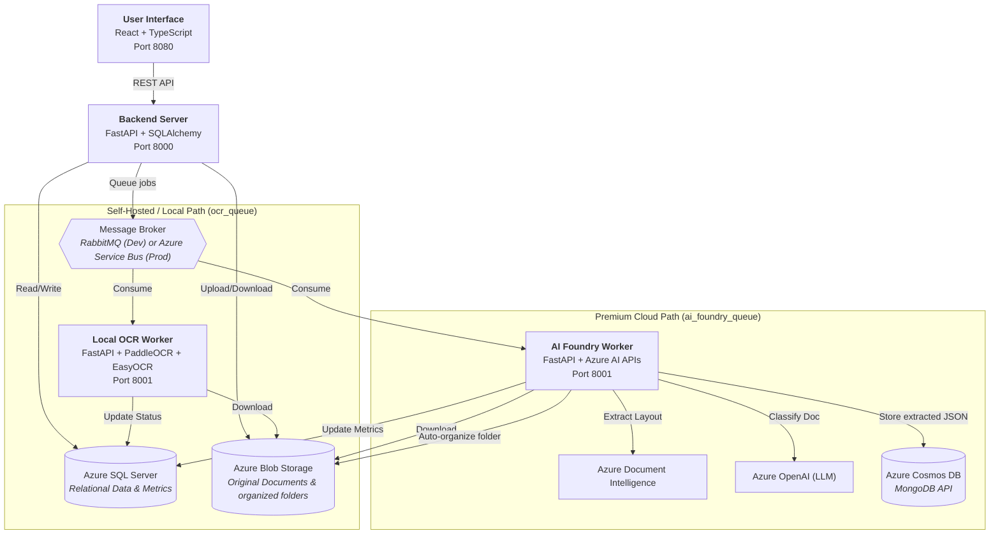
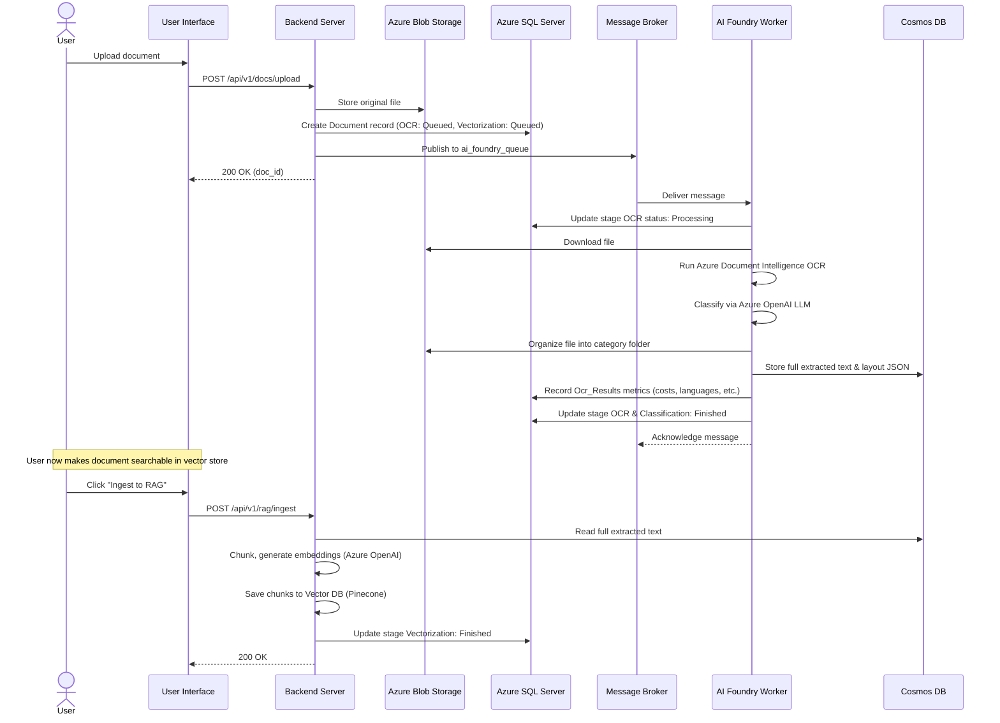

# NassaQ - Document Digitization Platform

<div style="text-align: center; margin: 2rem 0;">
  <h2 style="font-size: 2.5rem; font-weight: 800; margin-bottom: 0.5rem;">
    NassaQ
  </h2>
  <p style="font-size: 1.3rem; color: var(--md-default-fg-color--light);">
    Your AI Document Organizer: Summarize, Categorize, and Search Smartly
  </p>
</div>

---

## What is NassaQ?

**NassaQ** (Arabic: **نسّـق**, meaning "to organize" or "to format") is an AI-powered document management and digitization platform. It enables organizations to upload physical or digital documents and have them automatically processed through intelligent OCR pipelines that support both **Arabic** and **English** text extraction.

The platform transforms unstructured documents into searchable, categorized, and retrievable digital assets -- making it possible to go from a scanned page to a fully indexed, queryable piece of content in seconds.

### Core Capabilities

- **Processing Flexibility (Self-Hosted vs. Cloud)** -- Choice between:
    - **Self-Hosted / Local Mode**: Uses PaddleOCR and EasyOCR running locally for 100% data residency and offline execution.
    - **Premium Cloud Mode**: Uses Azure AI Document Intelligence and Azure OpenAI for premium accuracy, layout reconstruction, and speed.
- **AI-Powered Organization & Classification** -- Automates categorization of documents using GPT models and structures file storage inside Azure Blob Storage into category-based folders.
- **RAG & Semantic Search** -- An integrated retrieval-augmented generation engine utilizing Azure OpenAI embeddings, Pinecone vector database, and Cohere Rerank to query and retrieve answers from documents.
- **Dual Message Brokers** -- Durable asynchronous queuing using local RabbitMQ for development and Azure Service Bus for enterprise production environments.
- **Bilingual Support** -- Fully localized interface supporting English and Arabic with full RTL styling out of the box.
- **Role-Based Access Control** -- Granular database-backed user management and authorization.

---

## Platform Architecture at a Glance

NassaQ features a **microservices-based architecture** that is highly decoupled. It supports two distinct deployment and processing pathways:



| Component | Repository | Technology | Purpose |
|:---|:---|:---|:---|
| **User Interface** | [`NassaQ/User_Interface`](https://github.com/NassaQ/User_Interface) | React 18, TypeScript, Vite 5, Tailwind CSS, shadcn/ui | Main web portal for users and administrators |
| **Backend Server** | [`NassaQ/server`](https://github.com/NassaQ/server) | Python 3.11, FastAPI, SQLAlchemy 2.0, Azure SDKs, Pinecone | Central REST API, authentication, RAG, and orchestrator |
| **Local OCR Worker** | [`NassaQ/ocr-api`](https://github.com/NassaQ/ocr-api) | Python 3.11, FastAPI, PaddleOCR, EasyOCR, PyMuPDF | Offline self-hosted OCR processing queue consumer |
| **AI Foundry Worker** | [`NassaQ/ai-foundry`](https://github.com/NassaQ/ai-foundry) | Python 3.11, FastAPI, Azure Document Intelligence, Azure OpenAI, Motor | Premium cloud-native OCR, classification, and organization |

---

## Quick Start

Get the platform running locally in either **Local (Self-Hosted)** or **Production (Cloud)** topology.

### Prerequisites

- [Docker](https://docs.google.com/get-docker/) and [Docker Compose](https://docs.docker.com/compose/install/) installed.
- Active Microsoft Azure account with SQL Server, Blob Storage, Cosmos DB, and Azure AI resources.
- A copy of each repository cloned into a shared parent directory.

### 1. Clone the Repositories

```bash
mkdir nassaq && cd nassaq

git clone git@github.com:NassaQ/server.git
git clone git@github.com:NassaQ/ocr-api.git ocr
git clone git@github.com:NassaQ/ai-foundry.git ai-foundry
git clone git@github.com:NassaQ/User_Interface.git frontend
```

### 2. Configure Environment Variables

Each backend service requires its own `.env` file. Copy the examples and fill in your Azure and AI credentials:

```bash
cp server/.env.example server/.env
cp ocr/.env.example ocr/.env
cp ai-foundry/.env.example ai-foundry/.env
```

### 3. Launch with Docker Compose

Select your execution mode:

==== "Local Development (Self-Hosted)"
    To run the backend, local OCR worker, and local RabbitMQ:
    ```bash
    docker compose -f docker-compose.local.yml up --build
    ```

==== "Production/Cloud Mode (AI Foundry)"
    To run the backend, premium AI Foundry worker, and broker:
    ```bash
    docker compose -f docker-compose.prod.yml up --build
    ```

### 4. Start the Frontend

Run the React application locally:

```bash
cd frontend
npm install    # or: bun install
npm run dev    # or: bun dev
```

The UI will be available at [http://localhost:8080](http://localhost:8080).

---

## How It Works

The document ingestion and RAG process flow:



---

## Technology Stack

### Backend Services (Python)

| Category | Technology | Purpose |
|:---|:---|:---|
| **Framework** | FastAPI + Uvicorn | Async web framework and ASGI server |
| **ORM** | SQLAlchemy 2.0 (async) | Relational database access with async connection pooling |
| **Relational Database** | Azure SQL Server (ODBC 18) | Primary store for users, permissions, documents, and audit logs |
| **Document Database** | Azure Cosmos DB (MongoDB API) | Full JSON layout, OCR text, and processing metadata storage |
| **Vector Database** | Pinecone | Vector database for storing document chunk embeddings |
| **File Storage** | Azure Blob Storage | Original files, partitioned by category |
| **Message Broker** | RabbitMQ (Dev) / Azure Service Bus (Prod) | Async message distribution queues |
| **Auth** | python-jose + bcrypt | JWT tokens and secure password hashing |
| **AI Models (Cloud)** | Azure Document Intelligence + Azure OpenAI | Premium OCR and GPT document classification |
| **AI Models (Local)** | PaddleOCR + EasyOCR | Self-hosted fallback OCR engine |
| **Config** | Pydantic Settings | Environment variables management |
| **Package Manager** | uv | Fast Python dependency compiler |

### Frontend (TypeScript)

| Category | Technology | Purpose |
|:---|:---|:---|
| **Framework** | React 18 | Component-based UI library |
| **Build Tool** | Vite 5 (SWC) | Development and bundler tool |
| **Language** | TypeScript | Type safety |
| **Styling** | Tailwind CSS 3 | Utility-first CSS styling |
| **Components** | shadcn/ui (Radix UI) | Premium customizable components |
| **Routing** | react-router-dom v6 | Client-side routing |
| **Data Fetching** | TanStack React Query | Server state caching and querying |
| **i18n** | Custom React Context | Full English and Arabic (RTL) localization |

### Infrastructure

| Category | Technology | Purpose |
|:---|:---|:---|
| **Containers** | Docker + Docker Compose | Multi-container dev topology |
| **Cloud Hosting** | Microsoft Azure | Relational DB, Blob Storage, Cosmos DB, AI Services |

---

!!! warning "Graduation Project"
    NassaQ is developed as a graduation project. External contributions are not being accepted at this time. See the [Team](project/contributing.md) section for more details.
