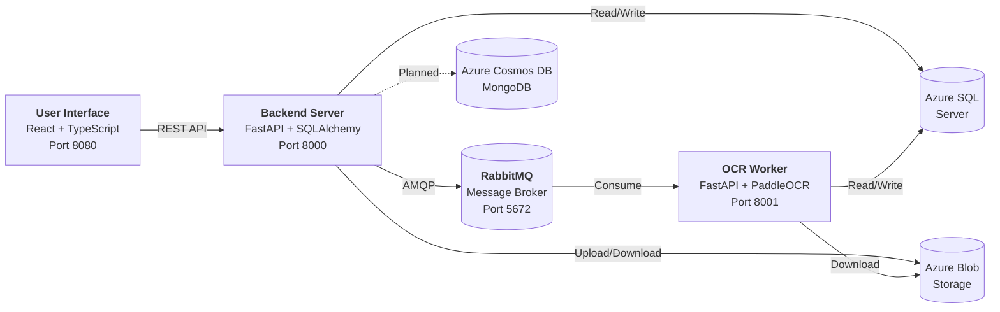
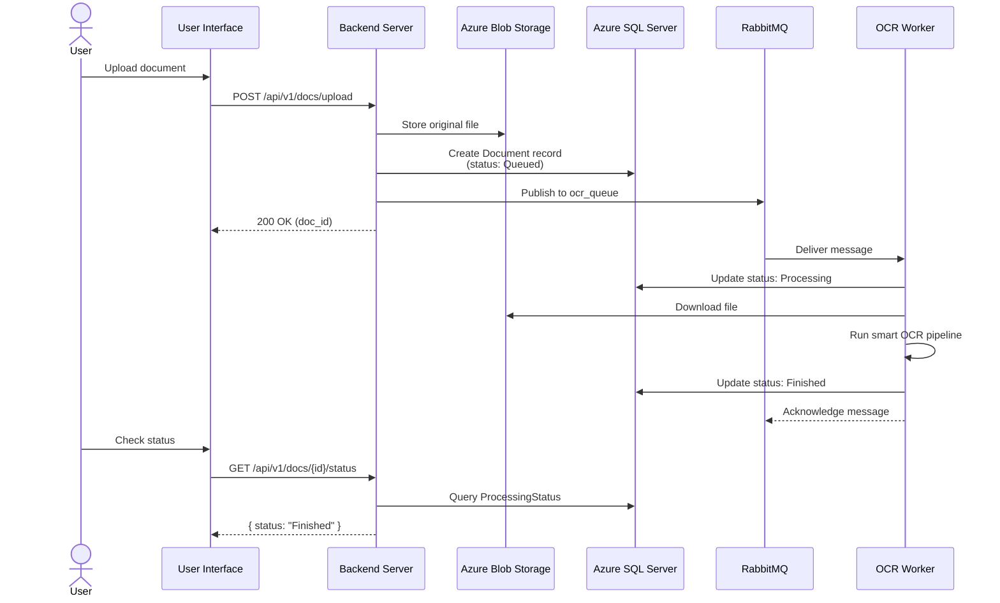

# NassaQ - Document Digitization Platform

<div style="text-align: center; margin: 2rem 0;">
  <h2 style="font-size: 2.5rem; font-weight: 800; margin-bottom: 0.5rem;">
    NassaQ
  </h2>
  <p style="font-size: 1.3rem; color: var(--md-default-fg-color--light);">
    Your AI Document Organizer: Summarize, Categorize, and Search Smartly
  </p>
</div>

---

## What is NassaQ?

**NassaQ** (Arabic: **نسّـق**, meaning "to organize" or "to format") is an AI-powered document management and digitization platform. It enables organizations to upload physical or digital documents and have them automatically processed through intelligent OCR pipelines that support both **Arabic** and **English** text extraction.

The platform transforms unstructured documents into searchable, categorized, and retrievable digital assets -- making it possible to go from a scanned page to a fully indexed, queryable piece of content in seconds.

### Core Capabilities

- **Dual-Engine OCR** -- A smart routing system that selects between PaddleOCR (optimized for speed and Latin scripts) and EasyOCR (optimized for Arabic cursive text) based on detected language
- **Multi-Format Processing** -- Handles PDFs (both digital and scanned), images (JPEG, PNG), and plain text files
- **Asynchronous Processing** -- Documents are queued via RabbitMQ and processed in the background, so users never wait
- **Cloud-Native Storage** -- All files are stored in Azure Blob Storage with metadata tracked in Azure SQL Server
- **Bilingual Interface** -- A fully localized web application supporting English and Arabic (RTL) out of the box
- **Role-Based Access Control** -- Users, roles, and permissions are managed through a structured authorization system

---

## Platform Architecture at a Glance

NassaQ follows a **microservices architecture** with three independently deployable components:



| Component | Repository | Technology |
|:---|:---|:---|
| **User Interface** | [`NassaQ/User_Interface`](https://github.com/NassaQ/User_Interface) | React 18, TypeScript, Vite 5, Tailwind CSS, shadcn/ui |
| **Backend Server** | [`NassaQ/server`](https://github.com/NassaQ/server) | Python 3.11, FastAPI, SQLAlchemy 2.0, Azure SDKs |
| **OCR Worker** | [`NassaQ/ocr-api`](https://github.com/NassaQ/ocr-api) | Python 3.11, FastAPI, PaddleOCR, EasyOCR, PyMuPDF |

---

## Quick Start

Get the entire platform running locally with Docker Compose.

### Prerequisites

- [Docker](https://docs.docker.com/get-docker/) and [Docker Compose](https://docs.docker.com/compose/install/) installed
- Azure credentials for SQL Server, Blob Storage, and (optionally) Cosmos DB
- A copy of each repository cloned into a shared parent directory

### 1. Clone the Repositories

```bash
mkdir nassaq && cd nassaq

git clone git@github.com:NassaQ/server.git
git clone git@github.com:NassaQ/ocr-api.git ocr
git clone git@github.com:NassaQ/User_Interface.git frontend
```

### 2. Configure Environment Variables

Each backend service requires its own `.env` file. Copy the examples and fill in your Azure credentials:

```bash
cp server/.env.example server/.env
cp ocr/.env.example ocr/.env
```

Each `.env.example` file documents every required and optional variable. See [Backend Server Setup](setup/backend.md#environment-variables) and [OCR API Setup](setup/ocr-worker.md#environment-variables) for descriptions of each variable.

### 3. Launch with Docker Compose

```bash
docker compose up --build
```

This starts three containers:

| Service | Container | URL |
|:---|:---|:---|
| **RabbitMQ** | `nassaq-rabbitmq` | [http://localhost:15672](http://localhost:15672) (Management UI) |
| **Backend Server** | `nassaq-server` | [http://localhost:8000](http://localhost:8000) |
| **OCR Worker** | `nassaq-ocr` | [http://localhost:8001](http://localhost:8001) |

### 4. Start the Frontend

The frontend runs separately (not yet containerized):

```bash
cd frontend
npm install    # or: bun install
npm run dev    # or: bun dev
```

The UI will be available at [http://localhost:8080](http://localhost:8080).

!!! tip "API Base URL"
    The frontend reads `VITE_API_BASE_URL` from the environment. It defaults to `http://127.0.0.1:8000`, which matches the Docker Compose server port.

---

## How It Works

The document processing flow follows these steps:



---

## Technology Stack

### Backend Services (Python)

| Category | Technology | Purpose |
|:---|:---|:---|
| **Framework** | FastAPI + Uvicorn | Async web framework and ASGI server |
| **ORM** | SQLAlchemy 2.0 (async) | Database access with async support |
| **Database** | Azure SQL Server (ODBC 18) | Primary relational data store |
| **Document DB** | Azure Cosmos DB (MongoDB API) | Document content storage (planned) |
| **File Storage** | Azure Blob Storage | Original and processed file storage |
| **Message Broker** | RabbitMQ (aio-pika) | Async job queue for OCR processing |
| **Auth** | python-jose + bcrypt | JWT tokens and password hashing |
| **OCR** | PaddleOCR + EasyOCR | Dual-engine text extraction |
| **PDF** | PyMuPDF (fitz) | PDF parsing and image extraction |
| **Image** | OpenCV (headless) | Image preprocessing for OCR |
| **Config** | Pydantic Settings | Environment-based configuration |
| **Package Manager** | uv | Fast Python dependency management |

### Frontend (TypeScript)

| Category | Technology | Purpose |
|:---|:---|:---|
| **Framework** | React 18 | Component-based UI library |
| **Build Tool** | Vite 5 (SWC) | Fast development and production builds |
| **Language** | TypeScript | Type-safe JavaScript |
| **Styling** | Tailwind CSS 3 | Utility-first CSS framework |
| **Components** | shadcn/ui (Radix UI) | Accessible, customizable component library |
| **Routing** | react-router-dom v6 | Client-side routing |
| **Data Fetching** | TanStack React Query | Server state management |
| **Forms** | React Hook Form + Zod | Form handling and validation |
| **Animations** | Framer Motion | Page and component animations |
| **i18n** | Custom React Context | English/Arabic with RTL support |

### Infrastructure

| Category | Technology | Purpose |
|:---|:---|:---|
| **Containers** | Docker + Docker Compose | Service orchestration |
| **Message Broker** | RabbitMQ 3 (Alpine) | Asynchronous job distribution |
| **Cloud** | Microsoft Azure | SQL Server, Blob Storage, Cosmos DB |

---

!!! warning "Graduation Project"
    NassaQ is developed as a graduation project. External contributions are not being accepted at this time. See the [Team](project/contributing.md) section for more details.
