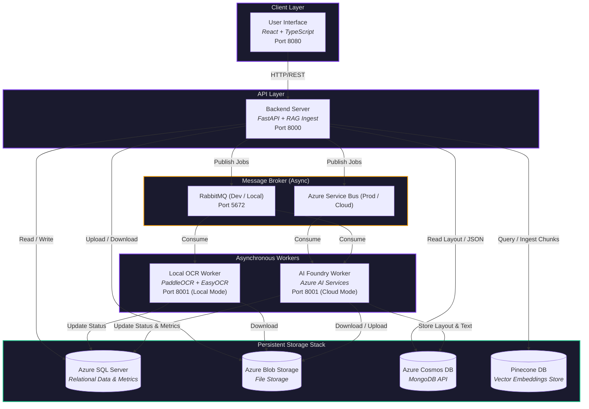
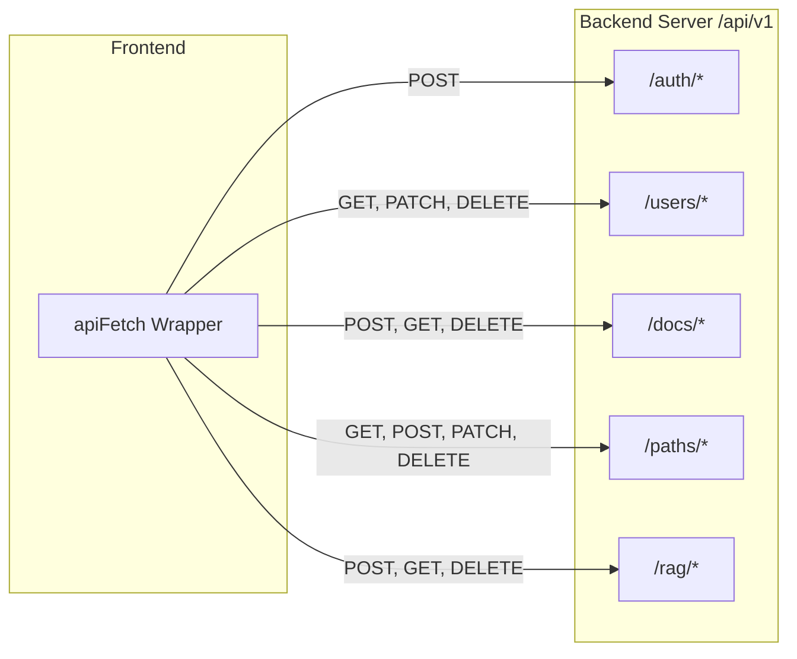
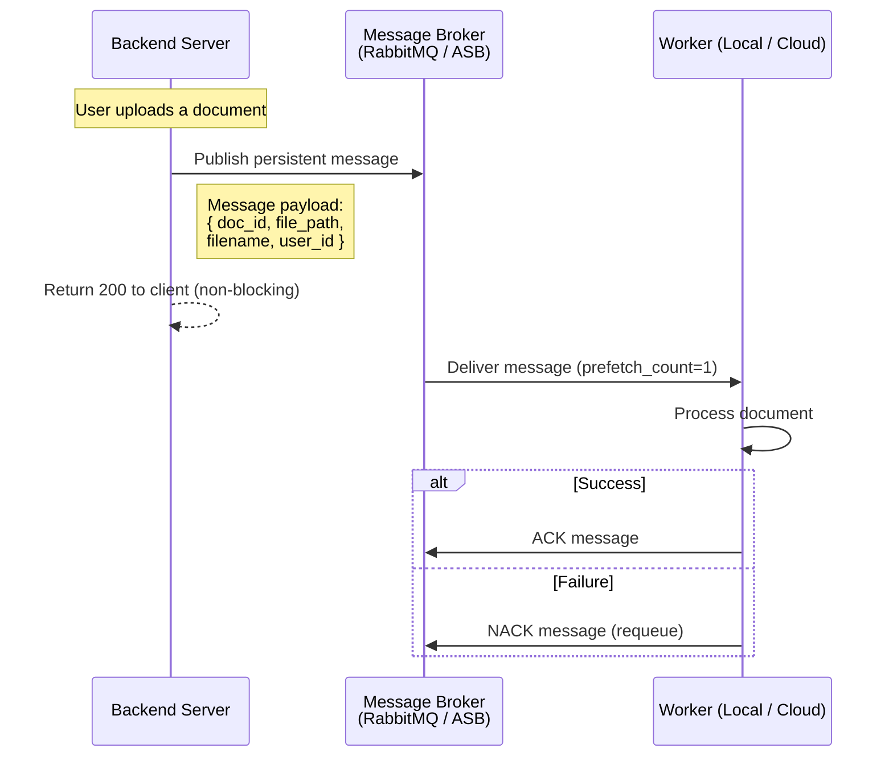
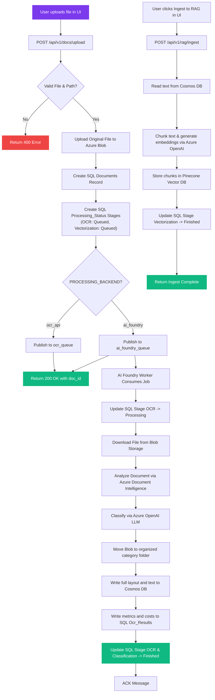
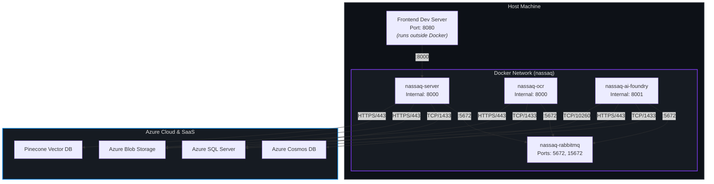

# System Design

This page provides a comprehensive overview of NassaQ's microservices architecture, how the services communicate, the dual-pipeline processing routes, and the design decisions behind the system.

---

## Architecture Overview

NassaQ is built as a **distributed system** supporting two different processing models depending on deployment needs:
1. **Self-Hosted / Local Mode**: Employs an offline-first stack using a local RabbitMQ broker and local OCR worker running PaddleOCR and EasyOCR. This ensures zero cloud costs and 100% data residency.
2. **Premium Cloud Mode**: Leverages Azure managed AI services (Azure Service Bus, Azure Document Intelligence, Azure OpenAI, Azure Cosmos DB, and Pinecone) to achieve high-speed, highly accurate extraction, automated categorization, and semantic RAG search capabilities.

### Design Principles

| Principle | Implementation |
|:---|:---|
| **Separation of Concerns** | Decouples front-end state, ingestion API, asynchronous file parsing, and vector ingestion into independent layers. |
| **Architectural Dualism** | The exact same database and API contract support both local, offline workers and premium, cloud-hosted AI workers. |
| **Asynchronous Deferral** | All heavy OCR, text extraction, and categorization processes run outside the user's request-response lifecycle. |
| **Shared Data Residency** | Services coordinate state using Azure SQL Server records and Azure Blob Storage files -- maintaining stateless application nodes. |
| **RAG Readiness** | Document parsing outputs are structured with page counts, word logs, and markdown layouts ready to be seamlessly chunked, embedded, and queried. |

---

## Service Descriptions

### User Interface

The frontend is a fully responsive **single-page application (SPA)** built with React, TypeScript, and Tailwind CSS. It communicates exclusively with the Backend Server via REST API calls.

**Responsibilities:**
- Localized bilingual layout (English / Arabic) with custom Right-to-Left (RTL) context support.
- File upload client integrating directly with the server’s REST endpoints.
- Interactive status polling to track OCR, Classification, and Vectorization phases.
- Unified RAG Search panel for entering natural language queries and presenting sourced, cited AI answers.

---

### Backend Server

The FastAPI server acts as the **central gateway** of the system. It governs authorization, data validation, database orchestration, and vector indexing.

**Responsibilities:**
- Verifies JWT authentication lifecycles (OAuth2 password flow with active token-refresh monitoring).
- Stores original uploads into Azure Blob Storage and initializes processing stages.
- Publishes processing payloads to RabbitMQ or Azure Service Bus based on `PROCESSING_BACKEND`.
- Pulls extracted texts from Cosmos DB, handles text chunking, generates embeddings, and uploads to Pinecone.
- Performs multi-stage semantic searches (Pinecone search → Cohere Rerank → GPT-based answer generation).

---

### Local OCR Worker

An **event-driven offline worker** designed for self-hosting. It runs on lightweight, CPU-based container infrastructure.

**Responsibilities:**
- Listens for messages on `ocr_queue`.
- Downloads the original file from Azure Blob Storage.
- Routes images and scanned pages to **PaddleOCR** or **EasyOCR** based on automatic language detection.
- Extracts native text from digital PDFs and falls back to rendering page-by-page images for scanned PDFs.
- Saves text outputs and JSON logs locally (under volume-mapped directories).
- Updates SQL Server database states (`Processing_Status` and `Documents`).

---

### AI Foundry Worker

A **high-performance, cloud-native worker** designed for the premium tier. It connects to managed Azure AI cognitive services.

**Responsibilities:**
- Listens for messages on `ai_foundry_queue` (supporting both RabbitMQ and Azure Service Bus).
- Runs **Azure Document Intelligence** layout models to extract premium text and table Markdown.
- Executes **Azure OpenAI LLM** classification models to categorize documents and write structural explanations.
- Moves files automatically inside Azure Blob Storage into structured category-based folders (e.g. `/invoice/bill.pdf`).
- Commits full layout schemas and text content to **Azure Cosmos DB** (MongoDB API).
- Commits structured document statistics (cost in USD, primary language, word counts) to the SQL Server `Ocr_Results` table.

---

## Communication Patterns

### REST API (Frontend <-> Server)

The frontend communicates with the server using standard HTTP REST calls. All API endpoints are versioned under `/api/v1/`.

---

### Message Queue (Server -> Workers)

The server and workers communicate asynchronously. This ensures uploads return instantly without blocking users during long-running OCR or LLM processes.

---

## Document Ingestion Flow

The complete end-to-end lifecycle of an uploaded document in **Premium Cloud Mode**:

---

## Network Topology

The network layout when running in local development with Docker Compose:

---

## Storage Architecture

### Azure Blob Storage (Originals & Folders)
Blob Storage acts as the shared storage backing all documents. 
- During **upload**, the server commits original files under a randomized root guid.
- During **cloud processing**, the AI Foundry worker downloads the file, processes it, and then re-uploads it organized under a clean category folder prefix (e.g. `invoice/bill_1.pdf`) while deleting the orphaned temporary upload.

### Azure Cosmos DB (MongoDB API)
Stores full layout JSON trees, metadata, and extracted text. This keeps SQL Server lean, as heavy page-by-page parsed strings are offloaded to Cosmos DB. Cosmos DB MongoDB documents are indexed by `_id`, which matches `Documents.mongo_doc_id` in SQL Server.

### Pinecone DB (Vector Search)
Stores embedded text chunks. Chunks are generated dynamically during the RAG Ingest phase and are tagged with metadata (`document_id`, `classification`, `language`, `source_file`) to support narrow target queries.

---

## Scalability Considerations

- **Horizontal Worker Scaling**: Since workers consume jobs asynchronously from queues, multiple container instances of both the `Local OCR Worker` or `AI Foundry Worker` can be spawned. RabbitMQ and Azure Service Bus will automatically round-robin tasks among them.
- **RAG & LLM Scaling**: The RAG pipeline offloads heavy embedding queries to Pinecone and Cohere APIs. Relieving local CPU bottlenecks allows the core server to handle thousands of requests per second.
- **Database Partitioning**: Storing relational schemas in SQL Server while maintaining large layouts in Cosmos DB prevents database lockups and enables independent scaling of NoSQL collections.
