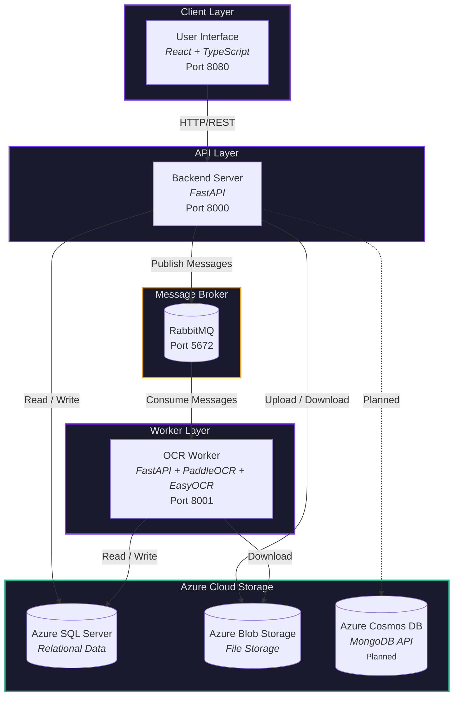
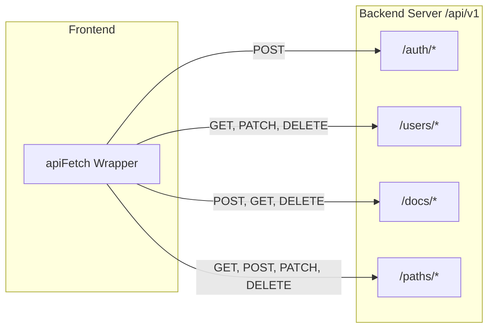
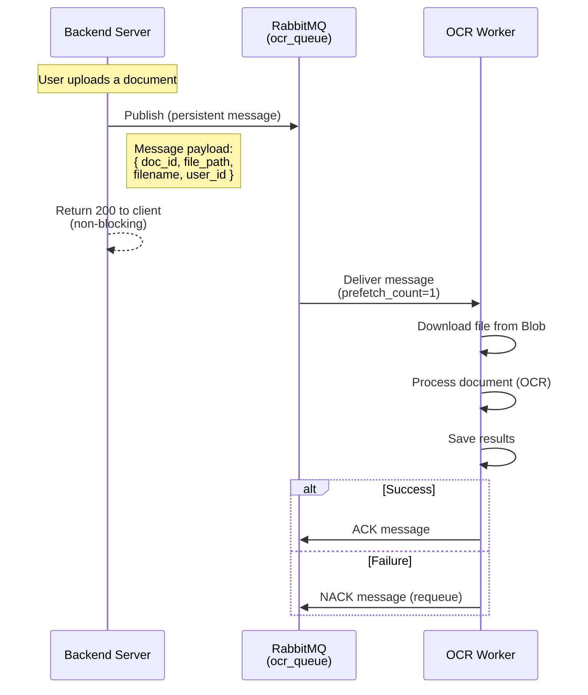
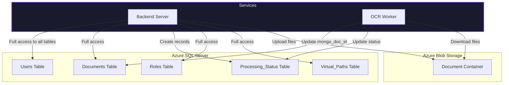
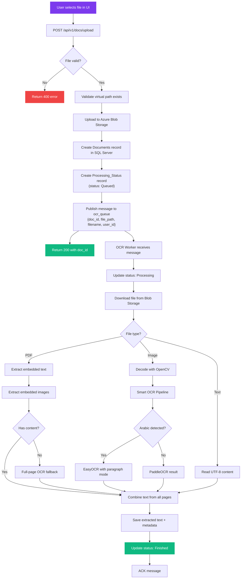
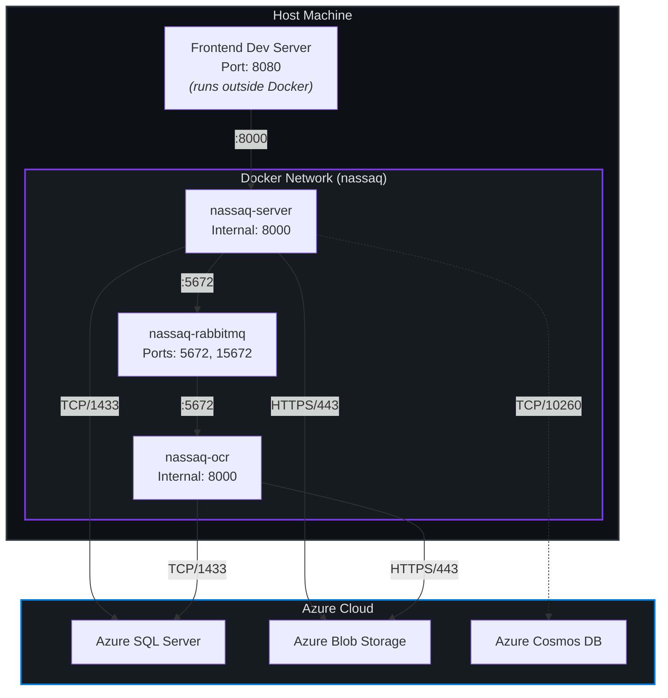
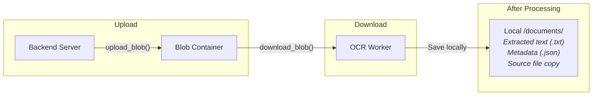

# System Design

This page provides a comprehensive overview of NassaQ's microservices architecture, how the services communicate, and the design decisions behind the system.

---

## Architecture Overview

NassaQ is built as a **distributed system** composed of three independent services, a message broker, and cloud-based data stores. Each service is developed, versioned, and deployed independently.



### Design Principles

| Principle | Implementation |
|:---|:---|
| **Separation of Concerns** | Each service has a single, well-defined responsibility |
| **Asynchronous Processing** | Long-running OCR tasks are decoupled from the API via message queues |
| **Shared Nothing** | Services share only the database and blob storage -- no in-memory state is shared |
| **Cloud-Native** | All persistent storage is on Azure managed services |
| **Independent Deployability** | Each service has its own Dockerfile, dependencies, and Git repository |

---

## Service Descriptions

### User Interface

The frontend is a **single-page application (SPA)** built with React and TypeScript. It communicates exclusively with the Backend Server via REST API calls.

**Responsibilities:**

- Render the public marketing site (landing, about, pricing, contact)
- Handle user authentication (login, registration)
- Provide the dashboard interface for document management
- Display document processing status
- Manage user profiles and settings

---

### Backend Server

The server is the **central API gateway** and the only service the frontend communicates with directly. It handles authentication, data validation, file uploads, and job dispatch.

**Responsibilities:**

- Authenticate users and manage JWT token lifecycle
- Validate and process file uploads
- Store files in Azure Blob Storage
- Create database records for documents and processing status
- Publish processing jobs to RabbitMQ
- Serve document status and metadata to the frontend
- Manage users, roles, and virtual file paths

---

### OCR Worker

The OCR worker is an **event-driven processor** that consumes jobs from RabbitMQ. It is designed to run independently and can be scaled horizontally by deploying multiple instances.

**Responsibilities:**

- Consume document processing messages from `ocr_queue`
- Download source files from Azure Blob Storage
- Route documents through the smart OCR pipeline (PaddleOCR vs. EasyOCR)
- Process PDFs (embedded text extraction, image OCR, full-page OCR fallback)
- Process images directly via the OCR pipeline
- Read plain text files without OCR
- Update processing status in the database (Queued -> Processing -> Finished/Failed)
- Save extracted text and metadata locally (with planned MongoDB migration)

---

## Communication Patterns

### REST API (Frontend <-> Server)

The frontend communicates with the server using standard HTTP REST calls. All API endpoints are versioned under `/api/v1/`.



**Authentication flow:**

1. Frontend sends credentials to `POST /api/v1/auth/login` (OAuth2 password flow)
2. Server returns an access token (short-lived) and refresh token (long-lived)
3. Frontend includes `Authorization: Bearer <token>` in all subsequent requests
4. When the access token is about to expire, the frontend proactively calls `POST /api/v1/auth/refresh`

---

### Message Queue (Server -> OCR Worker)

The server and OCR worker communicate asynchronously through RabbitMQ. This decouples the upload response time from the potentially slow OCR processing.



**Key characteristics:**

- Messages are **persistent** (survive broker restarts)
- Worker uses `prefetch_count=1` (processes one document at a time per instance)
- Failed messages are automatically **requeued** for retry
- Database operations use **exponential backoff** on connection failures (up to 3 retries)

---

### Shared Data Stores

Both the Backend Server and the OCR Worker access the same Azure SQL Server database and Azure Blob Storage container. They do **not** communicate directly with each other over HTTP.



!!! note "Access Patterns"
    The OCR Worker uses a **subset** of the database models. It only reads/writes to the `Documents` and `Processing_Status` tables. It never accesses user, role, or path data.

---

## Document Processing Flow

This is the complete end-to-end flow from a user uploading a document to the final processed result:



---

## Network Topology

The following diagram shows the network layout when running all services via Docker Compose:



| External Port | Service | Protocol | Purpose |
|:---|:---|:---|:---|
| `8080` | Frontend (Vite) | HTTP | Development web server |
| `8000` | Backend Server | HTTP | REST API |
| `8001` | OCR Worker | HTTP | Health check / direct upload (mapped to internal `8000`) |
| `5672` | RabbitMQ | AMQP | Message broker protocol |
| `15672` | RabbitMQ | HTTP | Management UI (username: `guest`, password: `guest`) |

---

## Storage Architecture

### Azure Blob Storage

Blob Storage is used as the **single source of truth** for all uploaded documents. Both the server (uploader) and the OCR worker (downloader) access the same container.



The storage layer is abstracted behind a `StorageBase` interface, allowing for future swapping between Azure Blob, local filesystem, or S3-compatible storage:

```python
class StorageBase(ABC):
    @abstractmethod
    async def upload(self, file, filename: str, path: str) -> str: ...

    @abstractmethod
    async def download(self, blob_url: str) -> bytes: ...

    @abstractmethod
    async def delete(self, blob_url: str) -> None: ...
```

### Azure SQL Server

SQL Server is the primary relational database, storing all structured data: users, roles, documents, processing status, virtual paths, permissions, and audit logs. See the [Database Schema](../concepts/database.md) page for detailed table documentation.

### Azure Cosmos DB (Planned)

Cosmos DB with the MongoDB API is planned as the storage layer for processed document content (extracted text, embeddings). The server configuration already includes MongoDB connection settings, but the integration is not yet complete.

---

## Scalability Considerations

| Aspect | Current Design | Scaling Path |
|:---|:---|:---|
| **OCR Processing** | Single worker instance, `prefetch_count=1` | Deploy multiple worker containers; RabbitMQ distributes jobs automatically |
| **Backend Server** | Single instance behind Docker | Add a load balancer (e.g., Nginx, Azure Application Gateway) with multiple server containers |
| **Database** | Azure SQL Server (managed) | Azure handles scaling; consider read replicas for heavy query loads |
| **File Storage** | Azure Blob (managed) | Effectively unlimited; Azure handles scaling transparently |
| **Message Broker** | Single RabbitMQ container | RabbitMQ clustering or migrate to Azure Service Bus (broker stub already exists) |

!!! info "Horizontal Scaling"
    The architecture is already designed for horizontal scaling at the worker level. Because the OCR worker consumes from a shared queue with `prefetch_count=1`, adding more worker containers immediately distributes the load without any code changes.
