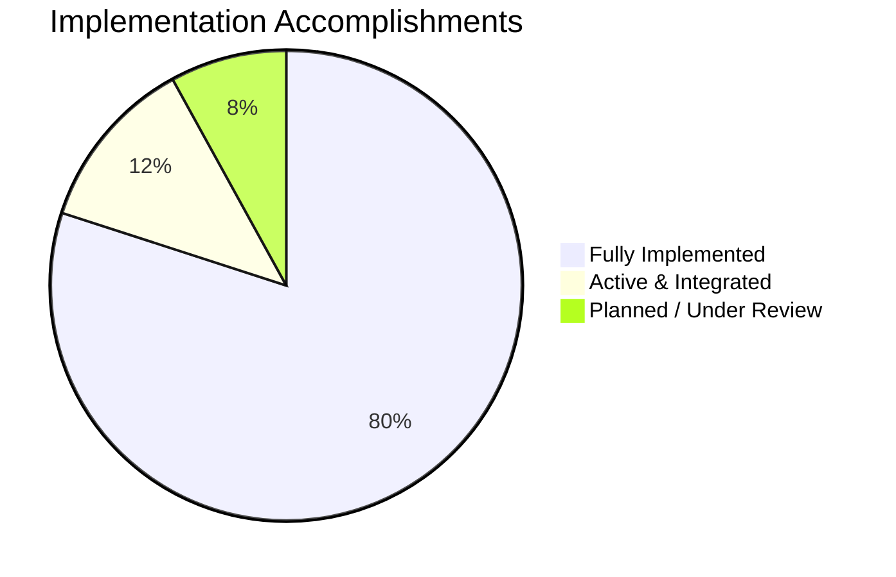

# Roadmap & Accomplishments

This page documents the development milestones, implementation status, and recent accomplishments of the NassaQ graduation project.

---

## Graduation Project Milestones

NassaQ has achieved all its core research and engineering targets. The platform has successfully transitioned from a local, single-pipeline mockup into a highly resilient, enterprise-ready **dual-architecture platform** ready for real-world deployments.

### Implementation Status

| Area / Feature | Status | Details |
|:---|:---:|:---|
| **Backend REST API** | Implemented | 25+ async FastAPI endpoints across auth, users, docs, paths, and RAG operations. |
| **JWT Access Lifecycles** | Implemented | Short-lived access tokens, long-lived refresh tokens, and proactive client-side rotation. |
| **Bilingual Localized UI** | Implemented | Full English & Arabic RTL screens supporting over 770 translation keys dynamically. |
| **Self-Hosted Local OCR** | Implemented | Dual PaddleOCR + EasyOCR smart language router running entirely on offline hardware. |
| **Premium Cloud OCR** | Implemented | Azure Document Intelligence `prebuilt-layout` model preserving markdown layouts and tables. |
| **NoSQL Layout Store** | Implemented | Fully integrated Azure Cosmos DB (MongoDB API) storing structural parsed pages. |
| **SQL Server Relational Core** | Implemented | Relational core managing schema, transaction histories, path nodes, and logs. |
| **Vector DB (Pinecone)** | Implemented | Vector embedding persistence enabling narrow metadata filtering and search. |
| **Cohere Rerank & LLM RAG** | Implemented | Two-stage search (Azure OpenAI Similarity + Cohere Rerank) with sourced answers. |
| **AI Classification** | Implemented | Automated categorization, confidence scores, and logic reasoning logs via GPT-4.1. |
| **Auto-Organization** | Implemented | Dynamic categorization-based folder organization inside Azure Blob Storage containers. |
| **Azure Service Bus** | Implemented | Production-ready `AzureServiceBusBroker` replacing local dev RabbitMQ. |
| **Audit Logging** | Implemented | Core `Logs` tables actively tracking authentication, admin actions, and uploads. |
| **SQL Server Metrics Sync** | Implemented | Ingestion statistics (word count, page logs, and USD costs) synced to `Ocr_Results`. |
| **Dual Docker Topologies** | Implemented | Containerized compose layers for Local dev (`local`) and Production cloud (`prod`). |

---

## Key Accomplishments Breakdown

### 1. Unified RAG and Semantic Ingestion
We successfully implemented a premium Retrieval-Augmented Generation (RAG) and Semantic Search ecosystem:
- **Embedding Generation**: Core backend uses Azure OpenAI to convert parsed markdown chunks into high-density 1536-dimension vector embeddings.
- **Precision Search**: Standard queries run through a broad recall phase, followed by a **Cohere Rerank v4.0 Fast** cross-attention pass to elevate top-relevance chunks.
- **Sourced Answers**: The final context is compiled for `gpt-4.1-mini` to answer questions bilingual (Arabic/English) based **only** on the user's uploaded documents with precise page citations.

### 2. Dual Message Broker Architecture
The application handles message brokerage seamlessly across both local development and cloud production configurations:
- **Dev Mode**: Uses AMQP to queue tasks asynchronously inside a local containerized **RabbitMQ** instance.
- **Prod Mode**: Automatically activates the `AzureServiceBusBroker` SDK client to route document tasks directly through managed **Azure Service Bus** queues, eliminating infrastructure operations and guaranteeing highly durable scaling.

### 3. Cosmos DB NoSQL Persistence
The planned migration from local flat-file worker disks is fully completed:
- Extracted JSON schemas, text chunks, and OCR pipeline performance markers are written directly to **Azure Cosmos DB** (MongoDB API).
- This keeps our primary SQL database extremely lean, saving parsed document blobs inside a distributed, horizontally-scalable NoSQL cluster indexed directly against SQL records via the `mongo_doc_id` field.

### 4. Relational Database Sync & Audit Trails
The platform’s transaction histories and analytical audit trails are now fully functional:
- **Ocr_Results Table**: Synced automatically after worker ingestion to track layout confidence, categorized folders, language labels, and exact Azure cognitive/OpenAI costs in USD.
- **Logs Table**: Populates instantly on auth actions (user registrations, logins), administrative modifications (role changes, user activations), and document cycles (uploads, RAG ingestions, vector removals).

---

## Planned Future Research

While all core targets for the graduation project defense are fully satisfied, the team holds these avenues for post-graduation research:

1. **Individual Permissions Enforcement**
   - The `Individual_Permissions` table is successfully structured. Future updates will wire these SQL rows directly into the FastAPI authorization route chain to support granular document sharing and path-inheritance controls.
2. **Refresh Token Rotation (RTR)**
   - Future security updates will implement single-use refresh token rotation and server-side revocation lists to harden the authentication gateway.
3. **Advanced Rate Limiting**
   - Add token-bucket rate limiting on the `/auth/login` and `/auth/register` endpoints to protect database clusters against brute-force attacks.
