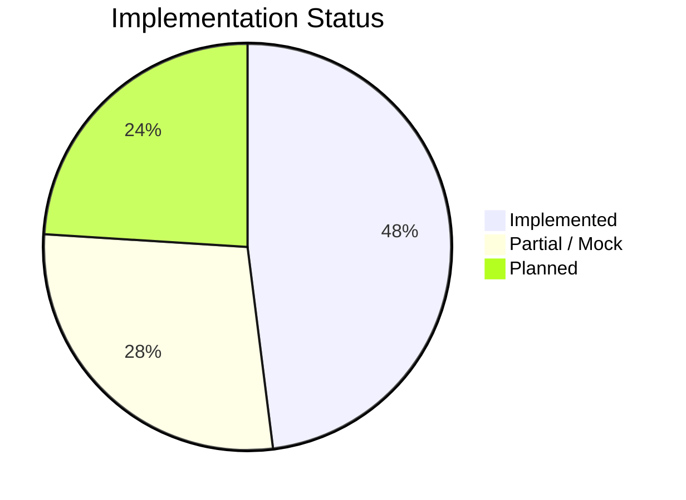
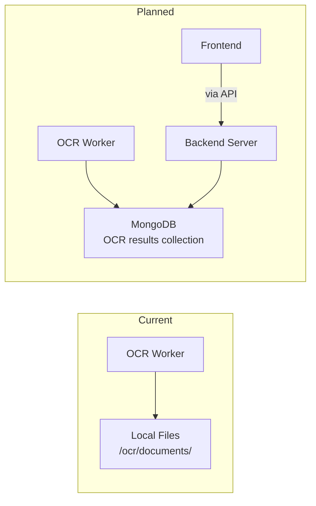

# Roadmap

Current development status, known TODOs from the source code, and planned features for the NassaQ platform.

## Current Status

### Implementation Overview



| Area | Status | Details |
|------|--------|---------|
| Backend REST API | <span class="status-implemented">Implemented</span> | 19 endpoints across auth, users, docs, paths |
| JWT Authentication | <span class="status-implemented">Implemented</span> | Access + refresh tokens, role-based access |
| OCR Pipeline | <span class="status-implemented">Implemented</span> | PaddleOCR + EasyOCR with smart Arabic detection |
| RabbitMQ Integration | <span class="status-implemented">Implemented</span> | Async document processing queue |
| Azure Blob Storage | <span class="status-implemented">Implemented</span> | File upload and storage |
| Azure SQL Server | <span class="status-implemented">Implemented</span> | 10-table schema, async queries |
| Docker Compose | <span class="status-implemented">Implemented</span> | 3-service orchestration |
| Frontend Auth Flow | <span class="status-implemented">Implemented</span> | Login, register, token refresh |
| Frontend Profile | <span class="status-implemented">Implemented</span> | View and edit profile via API |
| Frontend i18n | <span class="status-implemented">Implemented</span> | Full EN/AR with RTL, ~770 translation keys |
| Frontend Dark Mode | <span class="status-implemented">Implemented</span> | CSS custom properties + class toggle |
| Frontend Landing Pages | <span class="status-implemented">Implemented</span> | Index, About, Pricing, Contact |
| Dashboard UI | <span class="status-planned">Mock Data</span> | Stats and activity — no backend integration |
| Document History UI | <span class="status-planned">Mock Data</span> | List view — backend endpoints exist but not connected |
| User Management UI | <span class="status-planned">Mock Data</span> | Full CRUD UI — backend endpoints exist but not connected |
| Settings UI | <span class="status-planned">Mock Data</span> | Toggle controls — no backend endpoint |
| Billing UI | <span class="status-planned">Mock Data</span> | Plan comparison — no backend endpoint |
| Studio UI | <span class="status-planned">Mock Data</span> | AI content generation — no backend endpoint |
| Support / FAQ UI | <span class="status-planned">Mock Data</span> | Static content, no dynamic data |
| Document Upload UI | <span class="status-not-started">Not Started</span> | Backend endpoint exists (`POST /docs/upload`) |
| Document Search UI | <span class="status-not-started">Not Started</span> | No backend endpoint or UI |
| MongoDB OCR Storage | <span class="status-not-started">Not Started</span> | Currently uses local files |
| Azure Service Bus | <span class="status-not-started">Not Started</span> | Stub class exists in backend |
| Audit Logging | <span class="status-not-started">Not Started</span> | `Logs` table exists but not populated |
| Individual Permissions | <span class="status-not-started">Not Started</span> | `Individual_Permissions` table exists but not used |

---

## Source Code TODOs

These TODOs are extracted directly from the codebase:

### OCR Worker (`ocr/app/services/worker.py`)

| Line | TODO | Priority |
|------|------|----------|
| 263 | Move OCR output to MongoDB | High |
| 270 | Move OCR output to MongoDB | High |
| 282 | Remove processed files from local storage | Medium |

**Context:** The OCR worker currently saves processed output (OCR text, metadata, confidence scores) to local files in the `/ocr/documents` directory. The plan is to migrate this to MongoDB for centralized, queryable storage.

### Backend Server

| Area | TODO | Priority |
|------|------|----------|
| `AzureServiceBusBroker` | Implement the Azure Service Bus broker as a production alternative to RabbitMQ | Medium |
| `Logs` table | Populate with authentication events, admin actions, API access logs | Medium |
| `Individual_Permissions` table | Implement per-document permission sharing between users | Low |
| `Role_Actions` table | Implement action-level permissions beyond simple role_id checks | Low |

---

## Planned Features

### High Priority

#### 1. MongoDB Migration for OCR Output

**Current state:** OCR results are saved as local files (3 files per document: text, metadata JSON, confidence data). See the [Processing Pipelines](../guides/ocr-pipelines.md#output-format) page for details on the current output format.

**Target state:** Store all OCR output in MongoDB collections for:

- Full-text search across processed documents
- Structured metadata queries
- Centralized storage accessible by all services
- Elimination of local file management



#### 2. Frontend-Backend Integration

Connect mock data pages to existing backend endpoints. For a list of which frontend pages currently use mock data, see the [Components & Flows](../guides/frontend-components.md#pages-with-mockhardcoded-data) page.

| Page | Backend Endpoints to Connect |
|------|------------------------------|
| History | `GET /api/v1/docs/me`, `GET /api/v1/docs/{id}/status`, `DELETE /api/v1/docs/{id}` |
| Users (admin) | `GET /api/v1/users/all`, `GET /api/v1/users/pending`, `PUT /api/v1/users/{id}`, `DELETE /api/v1/users/{id}`, `POST /api/v1/users/{id}/activate` |
| Dashboard | Requires new stats/summary endpoint |

#### 3. Document Upload UI

Build a document upload interface connecting to `POST /api/v1/docs/upload`:

- File selection with drag-and-drop
- Virtual path (folder) selection
- Upload progress indicator
- Automatic status polling after upload

### Medium Priority

#### 4. TanStack React Query Migration

**Current state:** API calls use raw `apiFetch()` in `useEffect` hooks with manual loading/error state management. See the [Frontend API Integration](../guides/frontend-api.md#tanstack-react-query) page for the current state of the configured-but-unused QueryClient.

**Target state:** Migrate to React Query for:

- Automatic caching and deduplication
- Background refetching
- Optimistic updates
- Declarative loading/error states
- `QueryClient` is already configured but unused

#### 5. Azure Service Bus

**Current state:** RabbitMQ is used for development. The backend has an abstract `BaseBroker` class and a stub `AzureServiceBusBroker`. See the [Deployment](../setup/deployment.md) page for the current Docker Compose setup.

**Target state:** Implement `AzureServiceBusBroker` for production use, providing:

- Managed service (no infrastructure to maintain)
- Built-in dead letter queues
- Topic-based routing
- Integration with Azure monitoring

#### 6. Token Refresh Hardening

**Current state:** Refresh tokens are not rotated -- the same refresh token is reused for 7 days. See the [Security & Auth](../concepts/security.md#jwt-token-security) page for current JWT implementation details.

**Improvements needed:**

- Refresh token rotation (new refresh token on each use)
- Server-side refresh token storage for revocation
- Logout endpoint that invalidates refresh tokens

#### 7. Rate Limiting

Add rate limiting on sensitive endpoints:

| Endpoint | Recommended Limit |
|----------|------------------|
| `POST /auth/login` | 5 attempts per minute per IP |
| `POST /auth/register` | 3 attempts per minute per IP |
| `POST /auth/refresh` | 10 attempts per minute per user |

### Low Priority

#### 8. Password Reset Flow

Implement email-based password reset:

1. User requests reset via email
2. Server sends time-limited reset token
3. User clicks link with token
4. User sets new password

Requires email service integration (e.g., Azure Communication Services).

#### 9. Individual Permissions

The `Individual_Permissions` [database table](../concepts/database.md#individual_permissions) exists but is not used. Implement per-document sharing:

- Grant read/write access to specific users on specific documents
- Permission inheritance through virtual path hierarchy
- Permission management UI

#### 10. Audit Logging

The `Logs` [database table](../concepts/database.md#logs) exists but is not populated. Implement:

- Authentication events (login, logout, failed attempts)
- Admin actions (user activation, role changes, deletions)
- Document operations (upload, delete, status changes)
- API access logging for compliance

#### 11. Frontend Docker Containerization

The frontend currently runs outside Docker Compose. Add a containerized build:

```yaml
# Planned addition to docker-compose.yml
frontend:
  build:
    context: ./frontend
    dockerfile: Dockerfile
  ports:
    - "8080:80"
  depends_on:
    - server
```

---

## Known Limitations

### Backend

| Limitation | Impact | Workaround |
|-----------|--------|------------|
| No database migrations (Alembic) | Schema changes require manual SQL | Schema was reverse-engineered via sqlacodegen |
| Single JWT signing key | Key rotation invalidates all sessions | Restart server with new key |
| No CORS configuration in production | Frontend must be served from same domain or CORS must be configured | Set `CORS_ORIGINS` env var |
| Orphaned blobs on failed uploads | Blob uploaded but DB commit fails | Manual cleanup required |

### OCR Worker

| Limitation | Impact | Workaround |
|-----------|--------|------------|
| Local file storage for OCR output | Not accessible from other services | Planned MongoDB migration |
| Single worker instance | Limited throughput | Scale via Docker replicas |
| No GPU support in Docker | Slower OCR processing | Use host GPU with `--gpus` flag |
| Processed files not cleaned up | Disk space grows over time | Manual cleanup or TODO implementation |

### Frontend

| Limitation | Impact | Workaround |
|-----------|--------|------------|
| Most pages use mock data | Not functional with real data | Backend integration needed |
| No document upload UI | Core feature missing | Use API directly via curl/Postman |
| TanStack Query configured but unused | Manual state management in pages | Migrate to React Query |
| TypeScript strict mode off | Reduced type safety | Enable incrementally |
| No tests | No regression protection | Add testing framework |
| `sessionStorage` tokens | Not shared across tabs | Each tab requires separate login |
