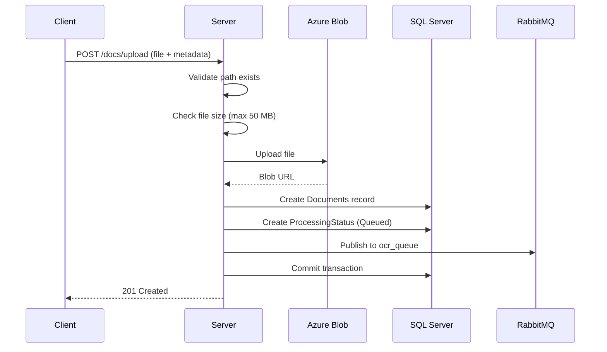

# API Reference

Complete reference for all REST API endpoints exposed by the backend server. All routes are prefixed with `/api/v1`. For details on how the frontend calls these endpoints, see the [Frontend API Integration](../guides/frontend-api.md) page.

## Overview

| Group | Prefix | Endpoints | Auth Required |
|-------|--------|-----------|---------------|
| [Authentication](#authentication) | `/api/v1/auth` | 3 | Partial |
| [Users](#users) | `/api/v1/users` | 7 | Yes |
| [Documents](#documents) | `/api/v1/docs` | 5 | Yes |
| [Virtual Paths](#virtual-paths) | `/api/v1/paths` | 4 | Yes |

### Authorization Levels

The API uses a dependency injection chain for authorization. For a detailed breakdown of how this chain works, see the [Security & Auth](../concepts/security.md#authorization-dependency-chain) page.

| Level | Dependency | Description |
|-------|-----------|-------------|
| **None** | -- | Public endpoint |
| **CurrentUser** | `get_current_user` | Valid JWT token required |
| **ActiveUser** | `get_current_active_user` | Token + `is_active=True` |
| **AdminUser** | `RoleChecker(role_id=99)` | Token + active + `role_id=99` |

---

## Authentication

### `POST /api/v1/auth/register`

Register a new user account. No authentication required.

**Auth:** None

**Request Body:**

```json
{
    "full_name": "John Doe",
    "email": "john@example.com",
    "username": "johndoe",
    "password": "20-Na$$aQ-26"
}
```

| Field | Type | Constraints | Required |
|-------|------|-------------|----------|
| `full_name` | `string` | 6-60 chars | Yes |
| `email` | `string` | Valid email, max 50 chars | Yes |
| `username` | `string` | 3-20 chars | No (auto-generated from email if omitted) |
| `password` | `string` | 8-64 chars, must contain a digit and a special character | Yes |

**Response:** `201 Created`

```json
{
    "user_id": 1,
    "full_name": "John Doe",
    "email": "john@example.com",
    "username": "johndoe",
    "role": null,
    "is_active": false,
    "created_at": "2026-02-26T14:30:00"
}
```

!!! note "Account Activation Required"
    Newly registered users have `is_active=false` and `role=null`. An admin must activate the user and assign a role before they can log in.

**Error Responses:**

| Status | Detail |
|--------|--------|
| `400` | Email already registered |
| `400` | Username already taken |

---

### `POST /api/v1/auth/login`

Authenticate with email and password using OAuth2 password flow.

**Auth:** None

**Request Body:** `application/x-www-form-urlencoded`

| Field | Description |
|-------|-------------|
| `username` | Email address (OAuth2 spec uses "username" field) |
| `password` | User password |

```bash
curl -X POST http://localhost:8000/api/v1/auth/login \
  -d "username=john@example.com&password=20-Na$$aQ-26"
```

**Response:** `200 OK`

```json
{
    "access_token": "eyJhbGciOiJIUzI1NiIs...",
    "refresh_token": "eyJhbGciOiJIUzI1NiIs...",
    "token_type": "bearer"
}
```

**Error Responses:**

| Status | Detail |
|--------|--------|
| `401` | Incorrect email or password |
| `403` | User is not active |

---

### `POST /api/v1/auth/refresh`

Refresh an access token using a valid refresh token.

**Auth:** Bearer token (refresh token)

**Request:** Send the refresh token as a Bearer token in the Authorization header.

```bash
curl -X POST http://localhost:8000/api/v1/auth/refresh \
  -H "Authorization: Bearer <refresh_token>"
```

**Response:** `200 OK`

```json
{
    "access_token": "eyJhbGciOiJIUzI1NiIs...",
    "token_type": "bearer"
}
```

**Error Responses:**

| Status | Detail |
|--------|--------|
| `401` | Invalid refresh token |
| `401` | Invalid token type (access token was provided instead) |
| `401` | User not found |

---

## Users

### `GET /api/v1/users/`

List all users with pagination.

**Auth:** AdminUser

**Query Parameters:**

| Parameter | Type | Default | Constraints | Description |
|-----------|------|---------|-------------|-------------|
| `skip` | `int` | `0` | >= 0 | Records to skip |
| `limit` | `int` | `20` | 1-100 | Max records to return |

**Response:** `200 OK` -- Array of `UserResponse`

---

### `GET /api/v1/users/pending`

List users pending role assignment (`is_active=false`).

**Auth:** AdminUser

**Query Parameters:**

| Parameter | Type | Default | Constraints |
|-----------|------|---------|-------------|
| `limit` | `int` | `20` | 1-50 |

**Response:** `200 OK` -- Array of `UserResponse`

---

### `GET /api/v1/users/me`

Get the current authenticated user's profile.

**Auth:** CurrentUser

**Response:** `200 OK`

```json
{
    "user_id": 1,
    "full_name": "John Doe",
    "email": "john@example.com",
    "username": "johndoe",
    "role": "Admin",
    "is_active": true,
    "created_at": "2026-02-26T14:30:00"
}
```

---

### `PATCH /api/v1/users/me`

Update the current user's profile (name and username only).

**Auth:** ActiveUser

**Request Body:**

```json
{
    "full_name": "John Updated",
    "username": "johnupdated"
}
```

| Field | Type | Constraints | Required |
|-------|------|-------------|----------|
| `full_name` | `string` | 6-60 chars | No |
| `username` | `string` | 3-20 chars | No |

**Response:** `200 OK` -- Updated `UserResponse`

**Error Responses:**

| Status | Detail |
|--------|--------|
| `400` | No fields to update |
| `400` | Username already exists |

---

### `PATCH /api/v1/users/{user_id}`

Update any user's profile (admin only).

**Auth:** AdminUser

**Path Parameters:**

| Parameter | Type | Description |
|-----------|------|-------------|
| `user_id` | `int` | Target user ID |

**Request Body:**

```json
{
    "full_name": "Updated Name",
    "email": "new@example.com",
    "username": "newusername",
    "role_id": 2,
    "is_active": true
}
```

| Field | Type | Required |
|-------|------|----------|
| `full_name` | `string` | No |
| `email` | `string` (email) | No |
| `username` | `string` | No |
| `role_id` | `int` | No |
| `is_active` | `bool` | No |

**Response:** `200 OK` -- Updated `UserResponse`

**Error Responses:**

| Status | Detail |
|--------|--------|
| `400` | Email/username already in use |
| `400` | Role does not exist |
| `404` | User not found |

---

### `PATCH /api/v1/users/{user_id}/activate`

Activate a user (set `is_active=true`). No request body allowed.

**Auth:** AdminUser

**Response:** `200 OK` -- Updated `UserResponse`

**Error Responses:**

| Status | Detail |
|--------|--------|
| `400` | Request body is not allowed |
| `404` | User not found |

---

### `DELETE /api/v1/users/{user_id}`

Delete a user account.

**Auth:** AdminUser

**Response:** `204 No Content`

**Error Responses:**

| Status | Detail |
|--------|--------|
| `400` | Cannot delete your own account |
| `400` | Cannot delete user (foreign key constraints) |
| `404` | User not found |

---

## Documents

### `POST /api/v1/docs/upload`

Upload a file for OCR processing.

**Auth:** ActiveUser

**Request:** `multipart/form-data`

| Field | Type | Description |
|-------|------|-------------|
| `file` | `File` | The file to upload |
| `description` | `string` (form) | Optional description |
| `full_path` | `string` (form) | Virtual path (default: root `""`) |

```bash
curl -X POST http://localhost:8000/api/v1/docs/upload \
  -H "Authorization: Bearer <token>" \
  -F "file=@document.pdf" \
  -F "full_path=finance/reports"
```

**Processing Flow:**



**Response:** `201 Created`

```json
{
    "filename": "document.pdf",
    "path": "https://account.blob.core.windows.net/container/finance/reports/document.pdf",
    "ctype": "application/pdf",
    "size": 1048576,
    "metadata": {
        "description": null,
        "full_path": "finance/reports"
    }
}
```

**Error Responses:**

| Status | Detail |
|--------|--------|
| `404` | Provided path doesn't exist |
| `409` | Document with this filename already exists at the specified path |
| `413` | File too large (max 50 MB) |
| `500` | Storage upload failed |

!!! info "Transactional Safety"
    If the database commit fails after blob upload, the server automatically **deletes the uploaded blob** to prevent orphaned files.

---

### `GET /api/v1/docs/`

List all documents with pagination and filtering (admin only).

**Auth:** AdminUser

**Query Parameters:**

| Parameter | Type | Default | Description |
|-----------|------|---------|-------------|
| `skip` | `int` | `0` | Records to skip |
| `limit` | `int` | `20` | Max records (1-100) |
| `status` | `string` | `null` | Filter: `Finished`, `Failed`, `Processing`, or `Queued` |
| `user_id` | `int` | `null` | Filter by uploader |

**Response:** `200 OK`

```json
{
    "total": 42,
    "items": [
        {
            "doc_id": 1,
            "filename": "report.pdf",
            "path": "/finance",
            "uploaded_by_user_id": 7,
            "uploaded_at": "2026-02-26T14:30:00",
            "status": "Finished",
            "error_message": null
        }
    ]
}
```

---

### `GET /api/v1/docs/me`

List the current user's documents with pagination and filtering.

**Auth:** ActiveUser

**Query Parameters:** Same as `GET /api/v1/docs/` except `user_id` (automatically scoped to current user).

**Response:** `200 OK` -- Same format as above.

---

### `GET /api/v1/docs/{doc_id}/status`

Check the OCR processing status for a specific document. Only returns results for documents owned by the current user.

**Auth:** ActiveUser

**Response:** `200 OK`

```json
{
    "doc_id": 1,
    "filename": "report.pdf",
    "stage_name": "OCR",
    "status": "Finished",
    "start_time": "2026-02-26T14:30:05",
    "end_time": "2026-02-26T14:30:12",
    "error_message": null
}
```

**Status Values:**

| Status | Description |
|--------|-------------|
| `Queued` | Waiting in RabbitMQ for OCR worker |
| `Processing` | OCR worker is actively processing |
| `Finished` | OCR completed successfully |
| `Failed` | OCR failed (see `error_message`) |

---

### `DELETE /api/v1/docs/{doc_id}`

Delete a document's database records and its blob from storage.

**Auth:** AdminUser

**Response:** `200 OK`

```json
{
    "doc_id": 1,
    "message": "Document deleted successfully."
}
```

**Error Responses:**

| Status | Detail |
|--------|--------|
| `404` | Document not found |
| `409` | Cannot delete while document is `Queued` or `Processing` |

!!! warning "Blob Cleanup"
    If the database records are deleted successfully but the blob deletion fails, the request still succeeds. The orphaned blob can be cleaned up separately.

---

## Virtual Paths

Virtual paths represent a folder hierarchy in Azure Blob Storage. They are stored in the `Virtual_Paths` table and used to organize uploaded documents.

### `GET /api/v1/paths/`

List all virtual paths with depth filtering and prefix search.

**Auth:** ActiveUser

**Query Parameters:**

| Parameter | Type | Default | Constraints | Description |
|-----------|------|---------|-------------|-------------|
| `minDepth` | `int` | `0` | 0-10 | Minimum folder depth |
| `maxDepth` | `int` | `5` | 1-30 | Maximum folder depth |
| `prefix` | `string` | `""` | -- | Path prefix filter |

**Response:** `200 OK`

```json
[
    {
        "id": 1,
        "full_path": "/",
        "description": "Root directory",
        "depth": 0,
        "created_at": "2026-01-01T00:00:00"
    },
    {
        "id": 2,
        "full_path": "finance/reports",
        "description": "Financial reports",
        "depth": 2,
        "created_at": "2026-02-15T10:00:00"
    }
]
```

---

### `POST /api/v1/paths/`

Create a new virtual path.

**Auth:** AdminUser

**Request Body:**

```json
{
    "full_path": "finance/reports/2026",
    "description": "2026 financial reports"
}
```

**Response:** `201 Created` -- `PathResponse`

The `depth` is calculated automatically from the number of path segments.

**Error Responses:**

| Status | Detail |
|--------|--------|
| `409` | Path already exists |

---

### `PATCH /api/v1/paths/{path_id}`

Update an existing path's `full_path` and/or `description`.

**Auth:** AdminUser

**Request Body:**

```json
{
    "full_path": "finance/reports/updated",
    "description": "Updated description"
}
```

**Response:** `200 OK` -- Updated `PathResponse`

**Error Responses:**

| Status | Detail |
|--------|--------|
| `404` | Path not found |
| `409` | New path already exists |

---

### `DELETE /api/v1/paths/{path_id}`

Delete a virtual path.

**Auth:** AdminUser

**Response:** `204 No Content`

**Error Responses:**

| Status | Detail |
|--------|--------|
| `400` | Cannot delete (documents reference this path) |
| `404` | Path not found |

---

## Common Error Format

All error responses follow this format:

```json
{
    "detail": "Human-readable error message"
}
```

Authentication errors include a `WWW-Authenticate` header:

```
WWW-Authenticate: Bearer
```

## Schemas Reference

### UserResponse

```json
{
    "user_id": "int",
    "full_name": "string",
    "email": "string (email)",
    "username": "string",
    "role": "string | null",
    "is_active": "bool",
    "created_at": "datetime"
}
```

### TokenLogin

```json
{
    "access_token": "string (JWT)",
    "refresh_token": "string (JWT)",
    "token_type": "bearer"
}
```

### TokenRefresh

```json
{
    "access_token": "string (JWT)",
    "token_type": "bearer"
}
```

### DocumentListItem

```json
{
    "doc_id": "int",
    "filename": "string",
    "path": "string",
    "uploaded_by_user_id": "int",
    "uploaded_at": "datetime",
    "status": "string | null",
    "error_message": "string | null"
}
```

### DocumentListResponse

```json
{
    "total": "int",
    "items": "DocumentListItem[]"
}
```

### FileUploadResponse

```json
{
    "filename": "string",
    "path": "string (URL or path)",
    "ctype": "string (MIME type)",
    "size": "int (bytes)",
    "metadata": {
        "description": "string | null",
        "full_path": "string"
    }
}
```

### PathResponse

```json
{
    "id": "int",
    "full_path": "string",
    "description": "string | null",
    "depth": "int",
    "created_at": "datetime"
}
```
