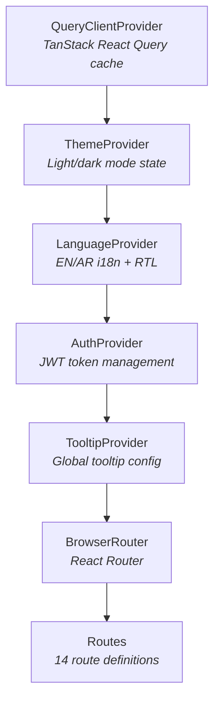

# User Interface - Setup

Project setup, build configuration, and development workflow for the NassaQ React frontend application. For component architecture and UI patterns, see the [Components & Flows](../guides/frontend-components.md) page. For how the frontend communicates with the backend, see the [API Integration](../guides/frontend-api.md) page.

## Prerequisites

| Tool | Version | Notes |
|------|---------|-------|
| **Node.js** | 18+ | LTS recommended |
| **npm** | 9+ | Comes with Node.js |
| **Git** | 2.x | Version control |

## Environment Variables

The frontend uses a single environment variable, accessed via Vite's `import.meta.env`:

| Variable | Required | Default | Description |
|----------|:--------:|---------|-------------|
| `VITE_API_BASE_URL` | No | `http://127.0.0.1:8000` | Backend API base URL (see [Backend Server Setup](backend.md)) |

!!! info "No `.env` File"
    The project does not include a `.env` file. The `VITE_API_BASE_URL` variable has a hardcoded fallback in `src/lib/api.ts`. To override it, create a `.env` file in the project root:

    ```bash
    # .env
    VITE_API_BASE_URL=http://localhost:8000
    ```

    Vite requires all client-exposed env vars to be prefixed with `VITE_`.

---

## TypeScript Configuration

The project uses a **project references** setup with three config files: `tsconfig.json` (root), `tsconfig.app.json` (application code), and `tsconfig.node.json` (Vite/Node tooling). The root config sets a `@/*` path alias mapping to `./src/*`.

!!! warning "Strict Mode Disabled"
    TypeScript strict mode is **off** (`"strict": false`). Key safety features like `strictNullChecks`, `noImplicitAny`, and `noUnusedLocals` are all disabled. This is common in rapid-development projects but should be tightened for production.

---

## Tailwind CSS Configuration

The Tailwind config extends the default theme with **shadcn/ui's design token system** using HSL CSS custom properties defined in `src/index.css`. Dark mode is toggled by adding the `.dark` class to `<html>`. All color tokens (primary, accent, background, foreground, card, muted, destructive, border) and custom animations (float, fade-in, slide-up, accordion-down/up) are configured in `tailwind.config.ts` — refer to that file for the exact values.

---

## ESLint Configuration

Uses the new **flat config** format (`eslint.config.js`). Key rules: React Hooks recommended rules are enforced, `react-refresh/only-export-components` is set to warn, and `@typescript-eslint/no-unused-vars` is disabled to reduce noise during development.

---

## shadcn/ui Setup

The project uses [shadcn/ui](https://ui.shadcn.com/) — a collection of copy-paste React components built on Radix UI primitives and styled with Tailwind CSS.

Configuration in `components.json`:

| Setting | Value |
|---------|-------|
| Style | `default` |
| Base color | `slate` |
| CSS variables | Enabled |
| Component alias | `@/components` |
| UI alias | `@/components/ui` |
| Lib alias | `@/lib` |
| Hooks alias | `@/hooks` |

The installed components are in `src/components/ui/` — see the [Components & Flows](../guides/frontend-components.md#shadcnui-components) page for the full list.

---

## Development Workflow

### Install Dependencies

```bash
npm install
```

### Start Development Server

```bash
npm run dev
```

This starts Vite's dev server at `http://localhost:8080` with:

- Hot Module Replacement (HMR) via SWC
- Auto-reload on file changes
- Path alias resolution (`@/` → `src/`)

### Lint Code

```bash
npm run lint
```

### Build for Production

```bash
npm run build
```

Outputs optimized static files to `dist/`. The build uses:

- SWC for transpilation (faster than Babel)
- Vite's Rollup-based bundling with tree-shaking
- CSS extraction and minification

### Preview Production Build

```bash
npm run preview
```

Serves the `dist/` output locally.

### Development Build

```bash
npm run build:dev
```

Builds with development mode settings (no minification, source maps included).

---

## Provider Hierarchy

The application wraps all routes in a layered provider structure defined in `App.tsx`:



This ordering matters — each provider can access context from its parent providers but not its children.

---

## Routing

All routes are defined in `App.tsx`:

### Public Routes

| Path | Page | Description |
|------|------|-------------|
| `/` | `Index` | Landing page |
| `/about` | `About` | About page with team info |
| `/pricing` | `Pricing` | Pricing tiers |
| `/contact` | `Contact` | Contact form |
| `/login` | `Login` | Authentication page |
| `/register` | `Register` | New user registration |

### Protected Routes

Wrapped in `<ProtectedRoute>` — redirects to `/login` if unauthenticated:

| Path | Page | Description |
|------|------|-------------|
| `/dashboard` | `Dashboard` | Main dashboard |
| `/studio` | `Studio` | AI content generation |
| `/history` | `History` | Document history |
| `/profile` | `Profile` | User profile |
| `/settings` | `Settings` | App settings |
| `/billing` | `Billing` | Billing and plans |
| `/support` | `Support` | Help and FAQ |
| `/users` | `Users` | User management |

### Catch-All

| Path | Page | Description |
|------|------|-------------|
| `*` | `NotFound` | 404 page |
